# BIGTREETECH Scylla V1.0 User Manual

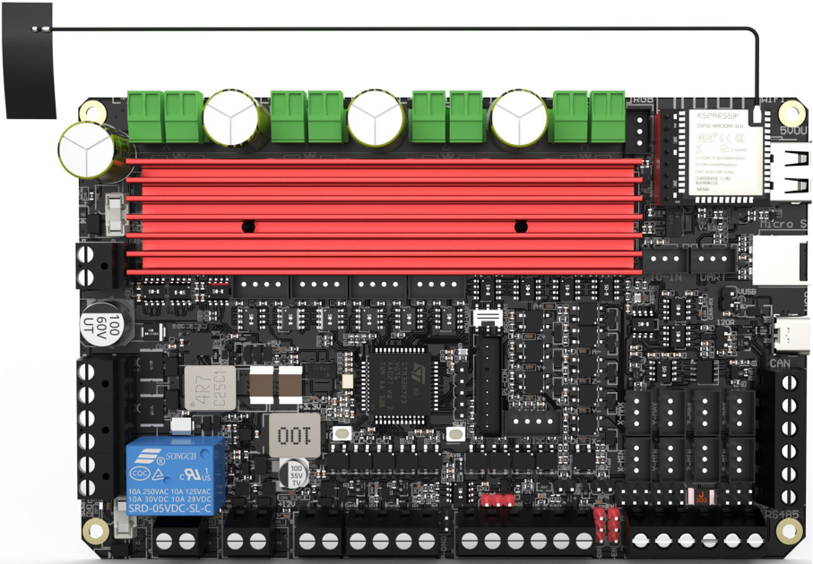

## Revision Log

|**Version**|**Date**|**Revisions**|
|---|---|---|
|v1.00|2024/12/20|Initial Version|

## Table of Contents

- [1 Product Profile](#1-product-profile)
  - [1.1 Features Highlights](#11-features-highlights)
  - [1.2 Specifications](#12-specifications)
  - [1.3 Firmware Support](#13-firmware-support)
  - [1.4 Product Size](#14-product-size)

- [2 Interface Overview](#2-interface-overview)
  - [2.1 Pin Description](#21-pin-description)
  - [2.2 Interface Description](#22-interface-description)

- [3 Interface Details](#3-interface-details)
  - [3.1 Power Supply Introduction](#31-power-supply-introduction)
    - [3.1.1 Primary Power Supply Interface](#311-primary-power-supply-interface)
    - [3.1.2 USB Port Power Supply](#312-usb-port-power-supply)
  - [3.2 Limit Switches](#32-limit-switches)
  - [3.3 5V Digital Input](#33-5v-digital-input)
  - [3.4 I2C Interface](#34-i2c-interface)
  - [3.5 UART Port](#35-uart-port)
  - [3.6 CAN Interface](#36-can-interface)
  - [3.7 RS485 Interface Description](#37-rs485-interface-description)
  - [3.8 Pi-CON Interface](#38-pi-con-interface)
  - [3.9 Probe & Tool Interface](#39-probe-tool-interface)
    - [3.9.1 Tool Interface Description](#391-tool-interface-description)
    - [3.9.2 Probe Interface Description](#392-probe-interface-description)
  - [3.10 Spindle/VFD Interface](#310-spindlevfd-interface)
  - [3.11 PWM Output Interface](#311-pwm-output-interface)
  - [3.12 Relay Interface](#312-relay-interface)
  - [3.13 Stepper Motor Drive Interface](#313-stepper-motor-drive-interface)
  - [3.14 RGB Interface](#314-rgb-interface)
  - [3.15 Wi-Fi Interface](#315-wi-fi-interface)

- [4 RRF Firmware](#4-rrf-firmware)
  - [4.1 Download Firmware](#41-download-firmware)
  - [4.2 Download DWC](#42-download-dwc)
  - [4.3 Burning Firmware](#43-burning-firmware)
  - [4.4 Reference Configuration](#44-reference-configuration)

## 1 Product Profile

The BIGTREETECH Scylla V1.0 is a control board for CNC engraving machines. It can communicate via USB, RS485, Wi-Fi or CAN. It is simple to install and easy to use.

### 1.1 Features Highlights

- 4 TMC 2160 drivers, each supporting voltage up to 56V and current up to 4.7A RMS.
- Large heatsink to keep drivers cool even under heavy load.
- Driver protection against excessive voltage and current back feed on the motor coil outputs.
- STEP/DIR/EN outputs for each motor to allow connection with external drivers if required. Each output is buffered to 5V signaling to provide maximum noise immunity. Note that we recommend using the internal drivers since they are heavily protected, well cooled and extremely capable.
- 8 Voltage selectable, optoisolated inputs for endstops or otherwise.
- 3 Voltage selectable, optoisolated, high-current, FET driven auxiliary outputs to drive external devices.
- 1 Mechanical relay with COM, NO and NC terminals exposed.
- 2 Probe and Tool optoisolated inputs supporting PNP or NPN connection with selectable pull up voltage.
- Completely isolated analogue VFD output supporting 0-10V with VFD-GND and VFD-12V supply inputs.
- Option to select analogue or digital VFD speed output.
- Optoisolated VFD direction output with dedicated VFD digital GND input.
- Dedicated, optoisolated outputs for coolant and mist.
- Dedicated, optoisolated spindle enable with reference to spindle digital GND.
- 3 Power inputs supporting from 24V to 56V with reverse polarity, over voltage and over current protection. One input is for Motor supply, another is for auxiliary MOSFET output supply and the final one is for logic supply.
- 1 5V digital input port.
- 1 RGB output supporting WS2812b and compatible devices.
- 1 I2C data port.

- 1 SPI data port for connecting to an external SBC such as a BTT Pi.
- 1 UART data ports.
- BOOT and RESET buttons for easy firmware programming.
- ESD protected CAN bus port for communication with peripheral devices.
- ESD protected RS485 port for communication with digital VFD or other peripheral devices. This port can also be controlled from an external source such as a BTT Pi via UART thereby enabling it to be used as a UART to RS485 converter for external devices.
- 1 ESD protected USB port for programming or for use as a sender IO port.
- 1 Wi-Fi module port for use with RRF or for use with grblHAL as a telnet sender channel.

### 1.2 Specifications

|Dimensions|164.34mm x 104.65mm|
|---|---|
|Installation Dimensions|For more information, please refer to: BIGTREETECH Scylla V1.0-SIZE.pdf|
|Microprocessor|32-bit Arm® Cortex® -M7 STM32H723VGT6 550MHz|
|Memory Interface|MicroSD Card|
|Input Voltage|V-Motor: DC24V-DC56V 10A; V-MCU: DC24V- DC56V 3A; V-MOS: DC24V-DC56V 10A|
|Logic Voltage|MCU and ESP32: 3.3V; Other Chips: DC 5V|
|Drive Current|Peak Value 6.7A RMS Value: 4.7A|
|DCDC 5V Output|6A, 7A (peak)|
|DCDC 12V Output|1.5A, 2A (peak)|
|Drive Mode|Onboard 4-channel TMC 2160 SPI mode, support DIAG function|
|Stepper Motor Interface|X, Y, Z, A|
|Communication Interface|USB Type-C, RS485, CAN, ESP32 Wi-Fi|
|Limit Switch Interface|8PCS (X-MIN, Y-MIN, Z-MIN, A-MIN, X-MAX, Y- MAX, Z-MAX, A-MAX )|
|PWM Output Interface|AUX0, AUX1, AUX2, MIST, COOL|
|Spindle Interface|SPIN (Enable, Digital Speed, Analogue Speed, Direction, Isolated Grounds and Voltage)|
|Digital Input|1 x Digital 5V|
|Detection Signal Input Interface|Probe, Tool|
|Extension Interface|SPI, I2C, UART, Relay|
|Connectors|JST-XH unless screw type|

### 1.3 Firmware Support

This Scylla currently only supports RRF and will be compatible with Remora + LinuxCNC and grblHAL in the future.

### 1.4 Product Size

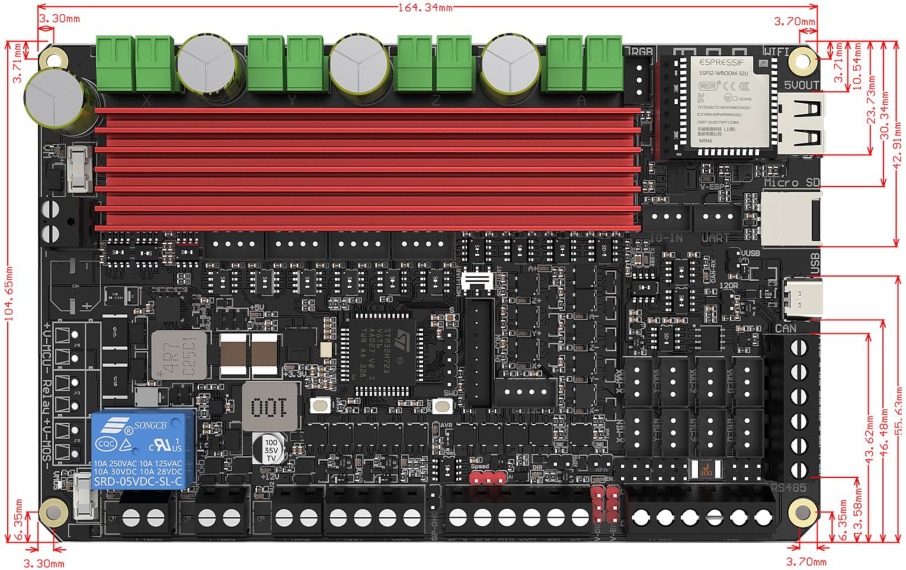

## 2 Interface Overview

### 2.1 Pin Description

Below is a diagram showing the function of each port and what pin on the MCU that port maps to. This information will assist you when trying to determine what pin to use in a firmware configuration file.

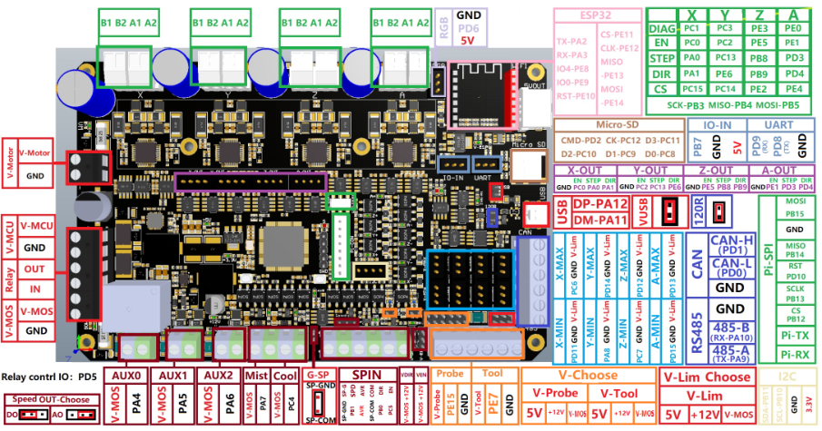

### 2.2 Interface Description

This diagram can be used in conjunction with the previous pin diagram if you are struggling to associate a port with the corresponding pin block.

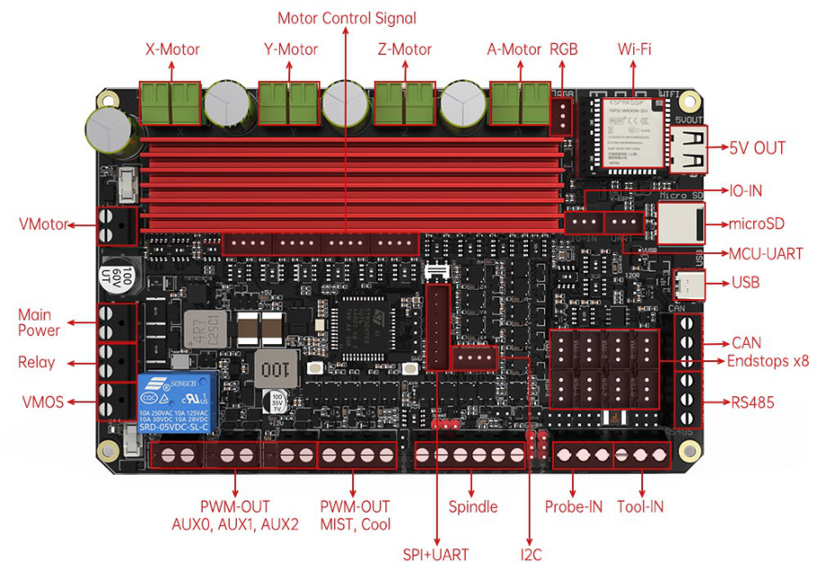

## 3 Interface Details

### 3.1 Power Supply Introduction

There are two methods to power the controller board. The first method is to power it using the high voltage inputs as shown in the image below. This is the standard method that will be used during normal operation. The second method is to power it via USB which is generally only used during firmware programming. These two methods cannot be used at the same time otherwise you may cause damage to the controller and/or your laptop which BIGTREETECH will not be held liable for. For more information on how to use each method safely, continue reading.

#### 3.1.1 Primary Power Supply Interface

The primary method to power the controller is to provide power to the VMotor, VMOS and VMCU inputs from one or more switch mode power supplies. When powered in this way the VM(Motor), VMOS, +12V, + 5V, + 3.3V power indicators light up to indicate that power is being received. The correct polarity for connecting the power supply is shown on the controller silk screen and in the image below.

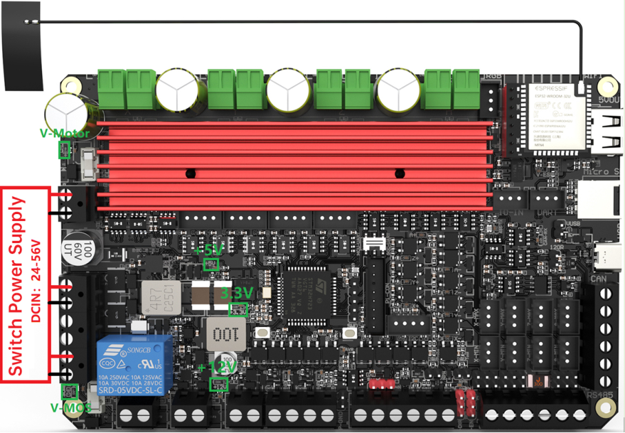

#### 3.1.2 USB Port Power Supply

This method can be used to provide power to the controller when you only want to power the logic portion of the board for the purpose of programming firmware. When using this method to supply power, you need to use a jumper to short the VUSB position and ensure that all power inputs are either turned off or disconnected from the primary power source(s). After USB power is turned on, you will see that the + 5V and + 3.3V power indicators are lit. Note: Be sure to remove the jumper once you are done powering the controller via USB! You can still use the USB port after the jumper is removed.

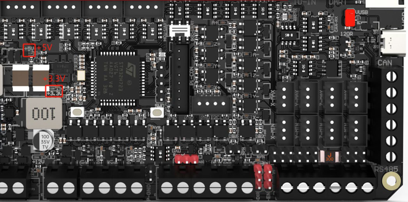

### 3.2 Limit Switches

The Scylla supports 8, optoisolated limit inputs. Some mills may only use a few of these inputs. If that is the case, you can configure the firmware to use the remaining inputs for any other application. Note that the labels on the diagram below do not imply that you must use the input according to the given label. They are only a suggestion. For example, you could use PC6 as X-MIN and PD11 as X-MAX and you would simply need to ensure that your firmware configuration and machine wiring correspond.

Each input features three pins; GND, VCC and IN. The VCC rail is designed to power whatever is driving the input device. In the case of simple, mechanical switches, there will be no need to use this rail. For other kinds of switches such as optical switches, you may need to power them using this rail. You can configure the voltage that is output on this rail using the jumpers in the diagram below. Move the jumper to the position that matches the voltage required by your limit switch devices. Note that the voltage is set for all 8 inputs by this jumper. There is a resettable fuse connected to the voltage output (highlighted in green below) that will trip at 3A. This protects both the controller board as well as the peripherals connected to it.

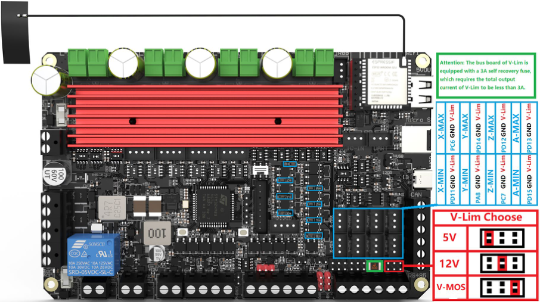

### 3.3 5V Digital Input

The Scylla features a single, 5V digital input. This is made available at the discretion of the end user. The input leakage current on this port will be less than

350nA. Note that exceeding 5V input on this port may cause damage to the controller.

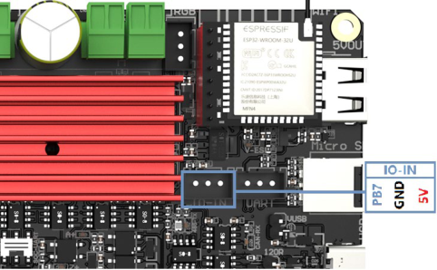

### 3.4 I2C Interface

The Scylla features a single I2C interface. This is provided for the user to decide how to use given their unique application. The pins are pulled up to 3.3V internally. Configuring the communication on this port is firmware specific therefore please reference the documentation for the firmware that you are using if you wish to use this port. Note that exceeding 3.3V on either the SCL or SDA pins may cause damage to the controller.

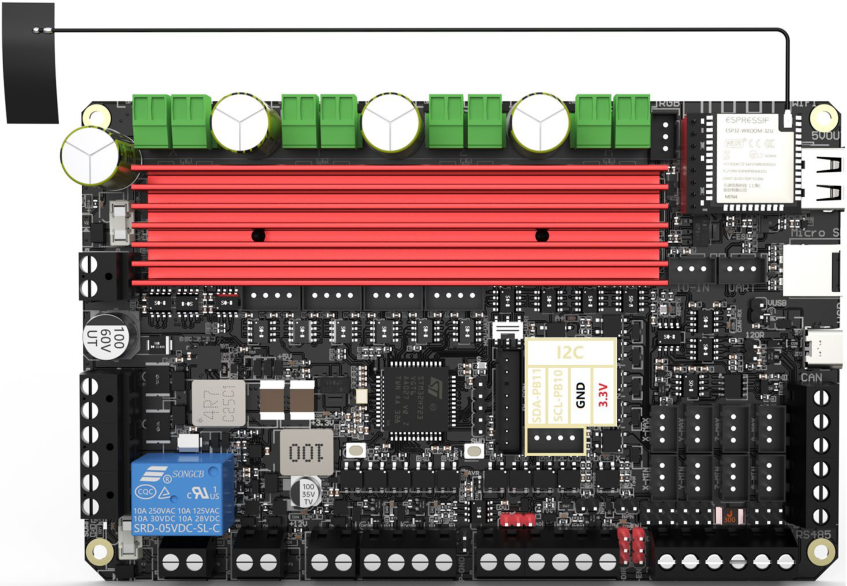

### 3.5 UART Port

The Scylla features a single, general purpose UART port. This is provided for the user to decide how to use given their unique application. Some applications may include connecting to an external pendant or display. Each pin is pulled up to 3.3V. Configuring the communication on this port is firmware specific therefore please reference the documentation for the firmware that you are using if you wish to use this port. Note that exceeding 3.3V on either the TX or RX pins may cause damage to the controller.

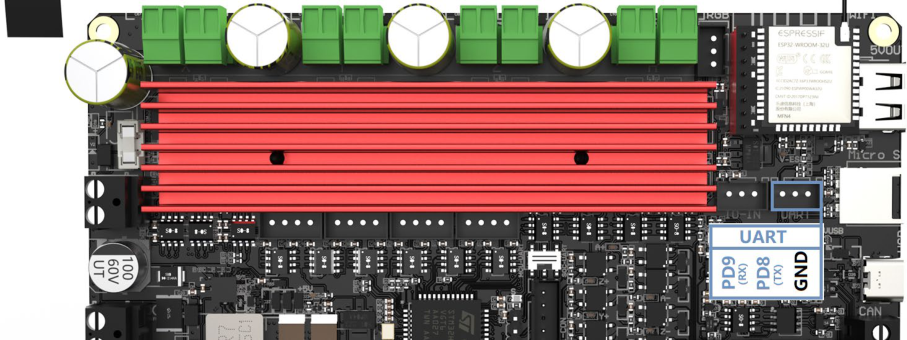

### 3.6 CAN Interface

The Scylla features a single CAN bus interface which can be used to connect the controller to external, secondary control boards when using firmware that supports this feature such as RRF. Configuring the communication on this port is firmware specific therefore please reference the documentation for the firmware that you are using if you wish to use this port. This port is ESD protected and over voltage protected up to 24V.

When using this port, be sure to insert the CAN bus jumper to connect the 120Ohm resistor if the Scylla is one of the devices on either end of the CAN network (it is likely to be). When there is active CAN bus communication, you will see the green, CAN bus LED (identified in the image below) blinking.

The location of the jumper as well as the location of the CAN bus port is shown in the diagram below.

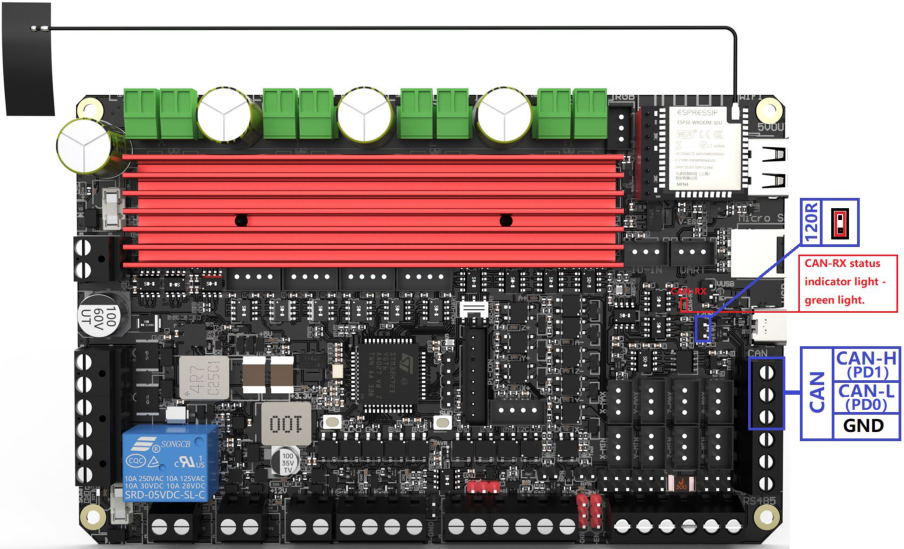

### 3.7 RS485 Interface Description

The Scylla features an RS485 interface that is very versatile and can be used in two ways.

The first way is by connecting it directly to the microcontroller on the Scylla and the second way is by connecting it to an external microcontroller so that it can be used as a UART to RS485 converter. The second method is useful when using LinuxCNC + Remora and you desire to host the RS485 communication directly from the Pi while the first method is more appropriate for firmware such as RRF and grblHAL. Use the switch as shown in the image below to select between one of the two methods.

When you select the SoC - UART method, you will need to connect the external Pi to the RS485 converter using the Pi-TX and Pi-RX pins on the Pi-CON connector. Note that exceeding 3.3V on these pins may cause damage to the controller.

The Scylla includes integrated RS485 bias resistors and termination resistors as well as RS485 communication indicator LEDs as shown in the image below. For details on how to configure the RS485 interface, please consult the documentation for your particular firmware and make use of the pin numbers provided in this manual.

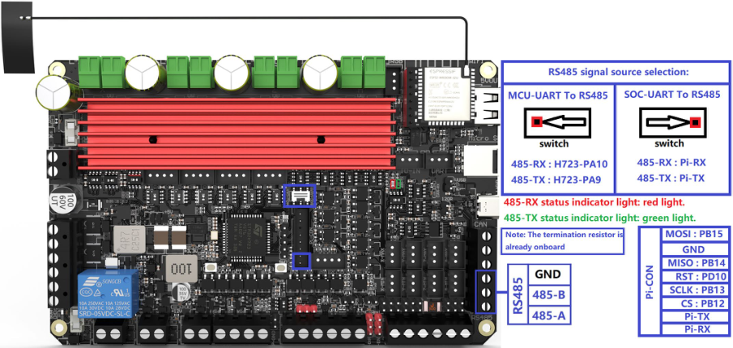

### 3.8 Pi-CON Interface

The previous section described how to use the Pi-TX and Pi-RX pins on the PiCON interface. The remaining pins are provided as an SPI interface between the Scylla and an external Pi. Note that exceeding 3.3V on these pins may cause damage to the controller.

If you plan to connect an external Pi to the Scylla using the SPI interface then you will need to follow the configuration documentation in the firmware you are using to activate the interface. Use the pin numbers provided in the above picture.

### 3.9 Probe & Tool Interface

#### 3.9.1 Tool Interface Description

The tool interface features an optically isolated input that supports tool setters that operate in either NPN or PNP modes. NPN refers to when the output of the tool setter is normally floating but high when active and requires a pull up to fix the state of the input when the tool setter is not active. PNP refers to when the output of the tool setter is normally high and low when active. Apply the jumper cap shown in green in the image below if using an NPN tool setter and remove it if using a PNP tool setter.

Both the tool setter and the optoisolator have their operating voltages defined by the state of the Vtool jumper as shown in the image below. Do not use the VMOS setting if the voltage supplied to VMOS is greater than 24V as this may cause damage to the controller.

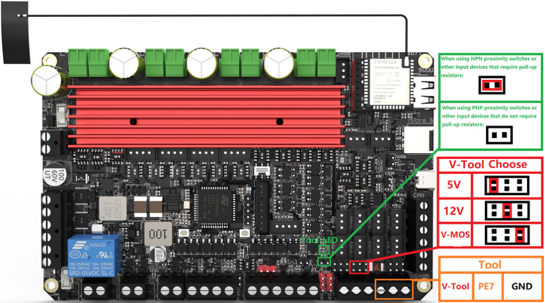

#### 3.9.2 Probe Interface Description

The probe features an optically isolated input that supports probes that operate in either NPN or PNP modes. NPN refers to when the output of the probe is normally floating but high when active and requires a pull up to fix the state of the input when the probe is not active. PNP refers to when the output of the probe is normally high and low when active. Apply the jumper shown in green in the image below if using an NPN probe and remove it if using a PNP probe.

Both the probe and the optoisolator have their operating voltages defined by the state of the Vprobe jumper as shown in the image below. Do not use the VMOS setting if the voltage supplied to VMOS is greater than 24V as this may cause damage to the controller.

### 3.10 Spindle/VFD Interface

The Scylla features an extremely versatile spindle/VFD interface providing voltage isolation, direction switching, an enable output as well as analogue and digital speed output selection.

The primary connection to the spindle interface is via the “SPIN” connector shown in the image below. Below is a pin description:

- SP-GND  This is the ground signal that will be used for the spindle speed control output. Note that you can connect the speed control ground to the spindle digital ground by inserting the SP-GND jumper shown in the image below. Only do this if you find that your spindle is not behaving as expected or if your VFD indicates that the two ground signals should be connected.
- SPD  This is the spindle speed output. It can be analogue or digital based on the jumper setting on the controller. Select the 0 to 10V analogue voltage output by placing the “Speed-OUT” jumper on the “AO” bridge. Select a digital PWM output by placing the jumper on the “DO” bridge. Generally most VFDs use an analogue speed signal.
- AVR  This is the voltage that will be used for the speed output. Connect the analogue or digital voltage source from your VFD to this pin. When you have successfully connected the SP-GND and the AVR inputs the SPINDLE_AVR LED (shown in the image below) will light up.
- SP-COM  This is the ground that is used for the digital IO on the VFD. The FWD/REV signal is referenced to this ground and it is internally connected to the Scylla logic ground via a 120 Ohm choke. Connect the digital ground from your VFD to this pin.
- SP-DIR  This connects to the direction pin of your VFD. In one state it is pulled to the digital ground supplied on SP-COM and in the other state it is connected to either VMOS or the +12V rail. You can select which voltage rail it will be connected to using the V-DIR jumper shown in the image below. You can tell the state of the spindle direction based on the SPIN_DIR LED shown in the image below. A lit LED indicates that the output is pulled to SP-COM. A non-lit LED indicates that the output is pulled to the selected voltage.
- SP-EN  This connects to the enable pin of your VFD. In one state it is pulled to the digital ground supplied on SP-COM and in the other state it is connected to either VMOS or the +12V rail. You can select which voltage rail it will be connected to using the V-EN jumper shown in the image below. You can tell the state of the spindle enable based on the SPIN_EN LED shown in the image below. A lit LED indicates that the output is pulled to SP-COM. A non-lit LED indicates that the output is pulled to the selected voltage.

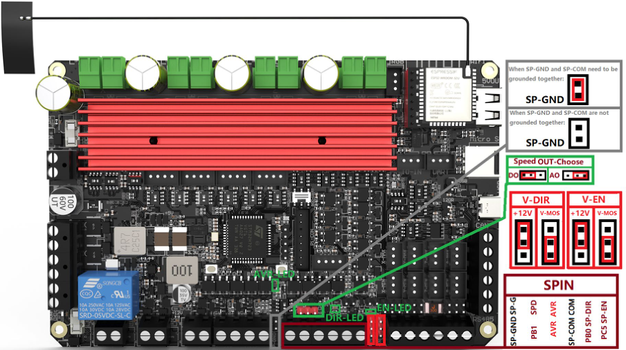

### 3.11 PWM Output Interface

The Scylla features five outputs that are optically isolated and driven by high power FETs. AUX0 to AUX2 are capable of driving up to 3A each. They each have

a resettable fuse that will trigger if the output exceeds 3A. Mist and cool are capable of driving up to 1A each. They each have a resettable fuse that will trigger if the output exceeds 1A.

Each output can be set to be a digital on/off or a PWM signal. For information about how to configure an output please consult the documentation for your particular firmware using the provided pin numbers for the output in question.

Each output also has an LED which indicates when it is active. The locations of all of the LEDs are shown in the image below.

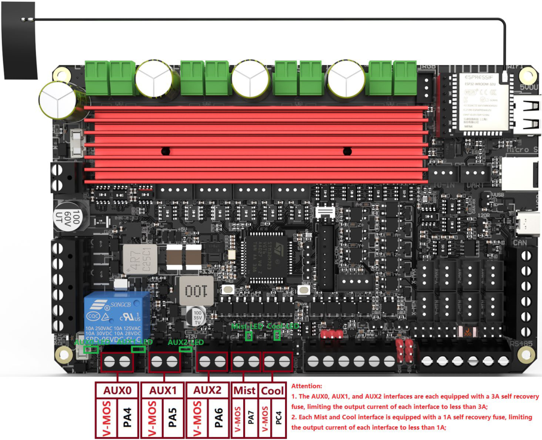

### 3.12 Relay Interface

The Scylla features a mechanical relay with exposed COM, NO and NC contacts. It supports switching 10A at either 230V/125V AC or 30V DC. The relay will connect the COM terminal to the NC terminal when the controller is powered off and when the controller is powered on but PD5 is low. It will connect the COM terminal to the NO terminal when the controller is powered on and PD5 is high.

Note: If using AC or high voltage, please take insulation measures for the bottom of the board, such as sticking insulation pads, etc.

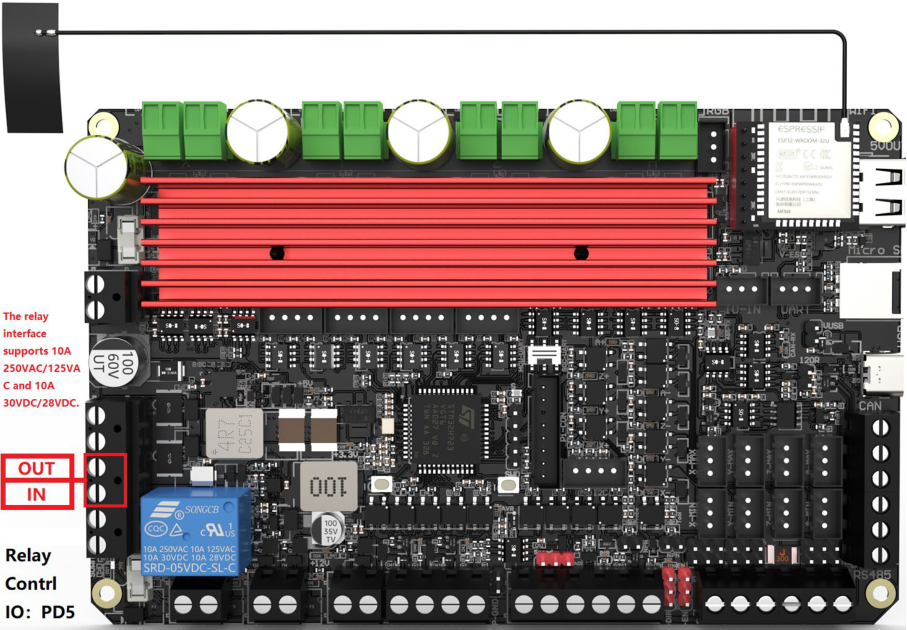

### 3.13 Stepper Motor Drive Interface

The Scylla features four TMC2160 stepper motor drivers each capable of delivering 4.7A RMS to a stepper motor. Each is protected against voltage back feed and cooled via a large heatsink. Each stepper motor channel can also be fed externally using a STEP/DIR/EN interface as shown in the image below.

The stepper drivers are powered via the Vmotor input which supports up to 56V. For details on how to configure your stepper drivers please see the instructions in the image below as well as the documentation for the particular firmware that you are using.

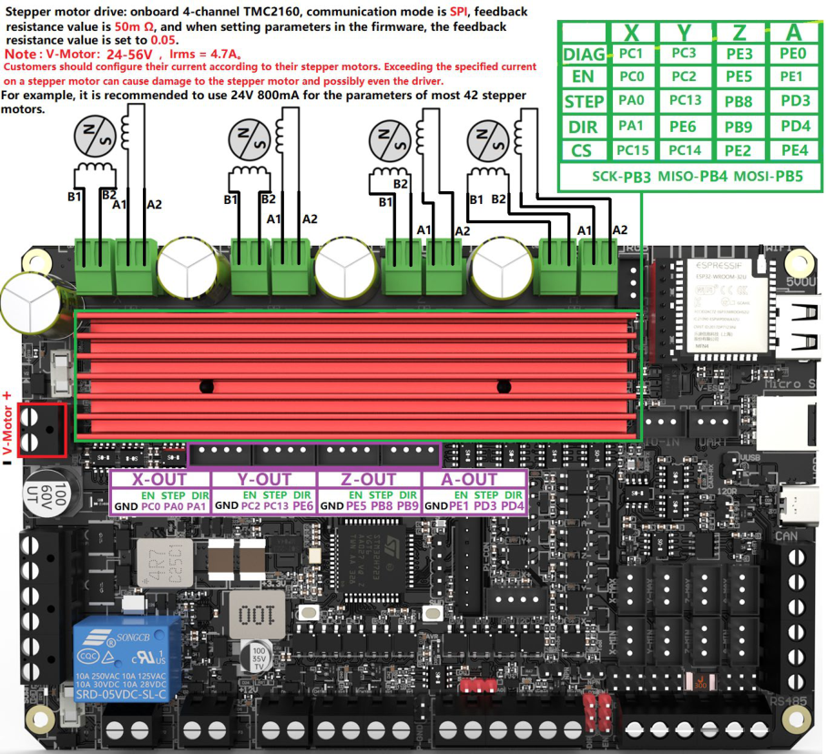

### 3.14 RGB Interface

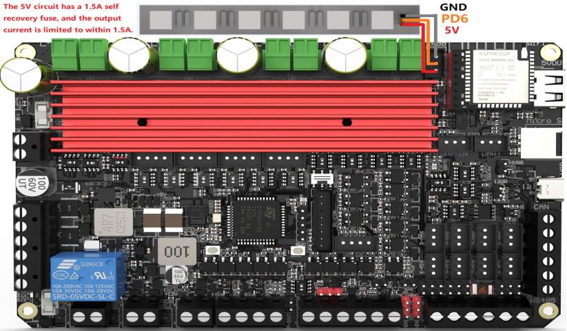

### 3.15 Wi-Fi Interface

A Wi-Fi interface is provided by an ESP32 module. This ESP32 module runs separate firmware to that of the Scylla however that firmware will be responsible for programming the module since the only communication access to the module is via the Scylla MCU.

If using RRF, consult the RRF documentation on how to program an external ESP32 module.

If using grblHAL, consult the grblHAL documentation on how to program an external ESP32 module.

The functionality that this module can provide will vary based on the firmware that you are using on the Scylla. In the case of RRF, it will host a rich web user interface that allows remote control and remote g-code downloading. In the case of grblHAL it will host a telnet server which allows remote sender connections for remote machine control. Each respective firmware will contain instructions on what it is capable of and how to enable that functionality.

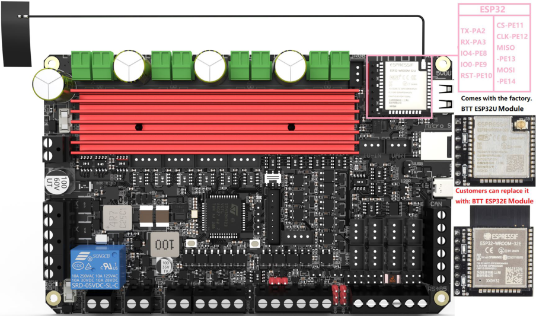

## 4 RRF Firmware

### 4.1 Download Firmware

1. <https://github.com/gloomyandy/RRFBuild> Find the latest stable version in releases, currently V3.5.4

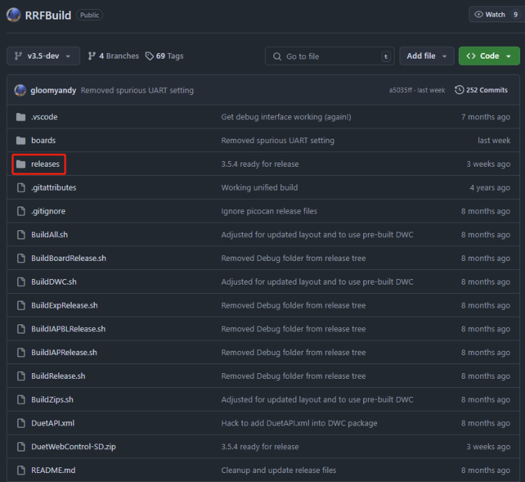

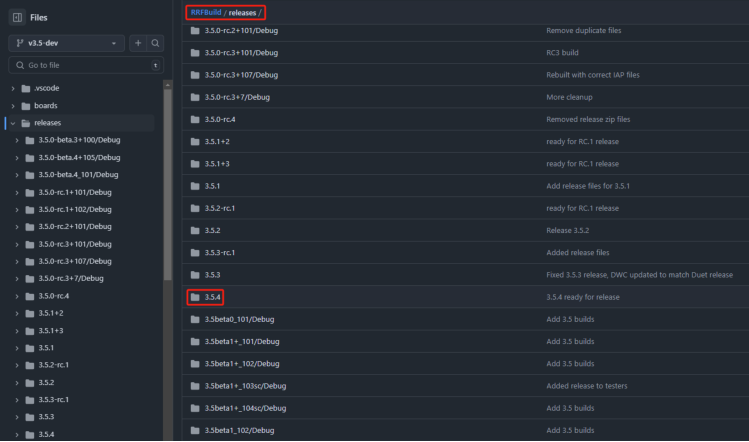

2. Find Scylla's firmware in the "mainboard/btt" path and download it.

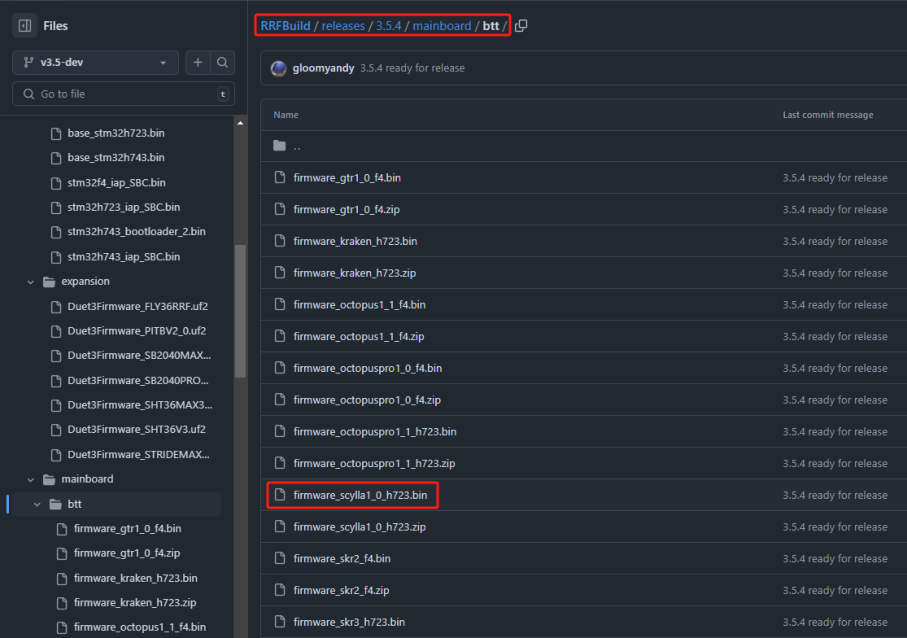

3. Find the Wi-Fi firmware in the "wifi" path and download it (recommended to use ESP32 module with Scylla).

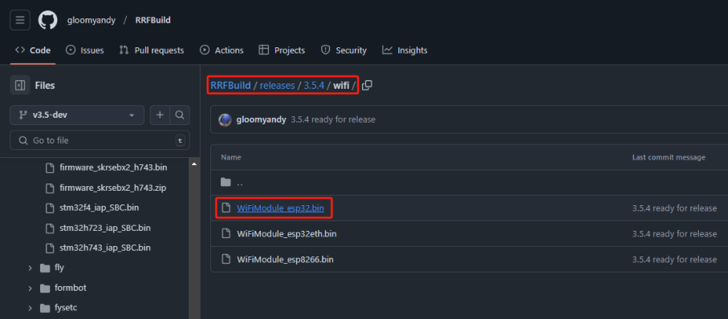

### 4.2 Download DWC

`1. https://github.com/Duet3D/DuetWebControl/releases` Download DWC and unzip

it.

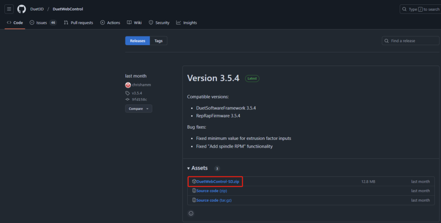

### 4.3 Burning Firmware

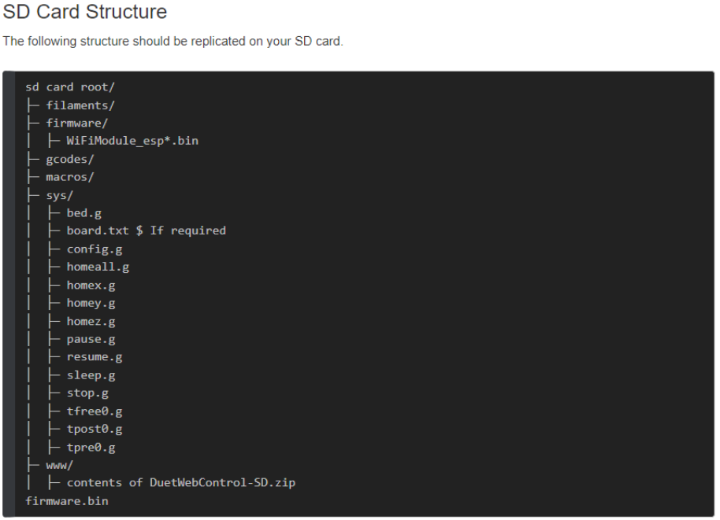

As shown in the above figure.

1. Copy the firmware of Scylla, firmware_stcylla1_0uh723.bin, to the root directory of the SD card and rename it to "firmware.bin" (the built-in boot program of the Scylla motherboard will recognize the firmware named firmware.bin and automatically update it to the MCU).
2. Create a "firmware" directory on the SD card and copy WiFiModulus_esp32.bin to the firmware directory.
3. Create a "www" directory on the SD card, extract the DWC files, and copy them all to the www directory.
4. Refer to the pin file in "boards/btt/scylla1_0uh723/rfpins.txt" to configure the config.g file in the sys directory.

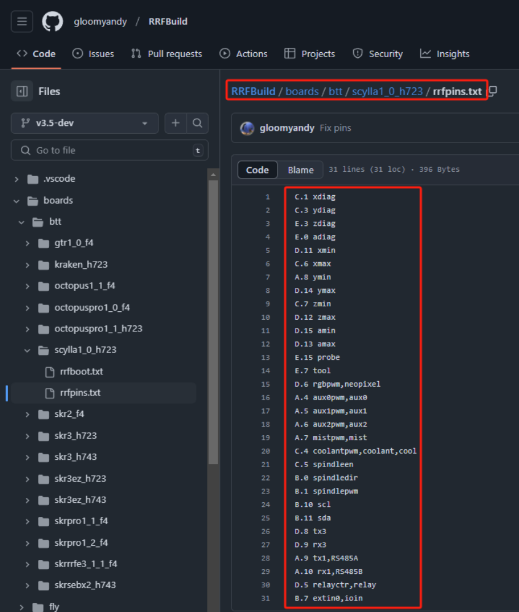

5. After all the files are prepared, insert the SD card into the SD card slot on the motherboard, power on the motherboard again, and the motherboard will automatically update firmware.bin. After the update is complete, it will automatically start. At this time, the motherboard can be connected to the computer through the Type-C interface. The computer will recognize the COM port of the motherboard, open this port, and enable DTR (if configured);

dispatch orders: M552 S0 M997 S1 Will start burning the firmware of the Wi-Fi module, wait for the burning to complete, and send commands: M552 S0 M587 S"your SSID" P"your password" M552 S1

You can connect the motherboard to the network through Wi-Fi.

### 4.4 Reference Configuration

More information about Scylla can be found at <https://teamgloomy.github.io/>

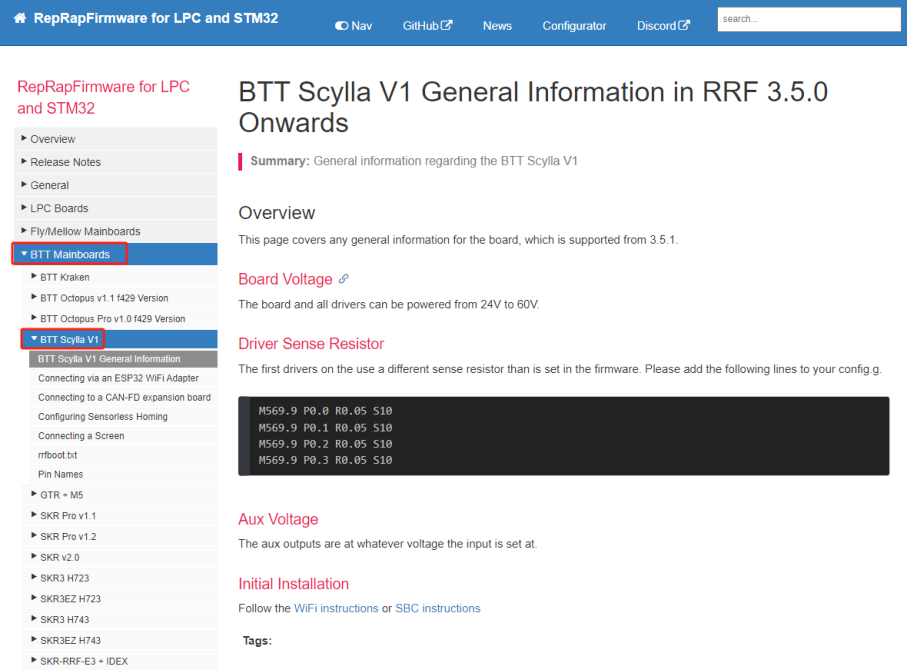

Should you require further resources for this product, you can find them at [GitHub](https://github.com/bigtreetech/). If you cannot find what you need, you may contact our after-sales support (service005@biqu3d.com).

If you encounter any other problems during use or have suggestions or feedback, please contact us. Thank you for choosing BIGTREETECH products.
