**HUAN YANG**

**Huanyang Electricity Manufacture Factory**

**http://www.h-y.tw**

HY Series Inverter

User Manual

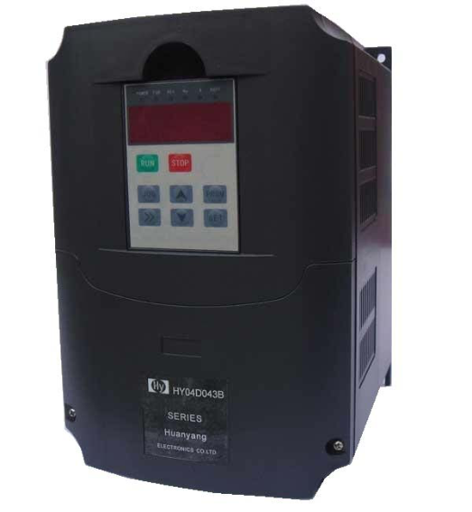

**Edited by**


**CNCDIY CNC Routing Machines System** Website: www.cncdiy.org Email: cncdiy_selling@ymail.com

**Chinese version is the standard one, English version is only for reference.**

27 June 2010

## Contents

- [I. Introduction](#i-introduction)
  - [1. Checks upon Delivery](#1-checks-upon-delivery)
  - [2. Nameplate Description of HY Series Inverter](#2-nameplate-description-of-hy-series-inverter)
- [II. Safety Precautions](#ii-safety-precautions)
  - [1. Before the Power-up](#1-before-the-power-up)
  - [2. During the Power-up](#2-during-the-power-up)
  - [3. During the Operation](#3-during-the-operation)
- [III. Standards and Specifications](#iii-standards-and-specifications)
  - [1. Particular Specifications](#1-particular-specifications)
  - [2. General Specifications](#2-general-specifications)
- [IV. Storage and Installation](#iv-storage-and-installation)
  - [1. Storage](#1-storage)
  - [2. Installation Site and Environment](#2-installation-site-and-environment)
  - [3. Installation and Direction](#3-installation-and-direction)
- [V. Wiring](#v-wiring)
  - [1. Main Circuit Wiring Schematic Diagram](#1-main-circuit-wiring-schematic-diagram)
  - [2. Description of Terminal Block](#2-description-of-terminal-block)
  - [3. Basic Connection Diagram](#3-basic-connection-diagram)
  - [4. Precautions on Wiring](#4-precautions-on-wiring)
- [VI. Instruction of the Digital Operator](#vi-instruction-of-the-digital-operator)
  - [1. Description of the Digital Operator](#1-description-of-the-digital-operator)
  - [2. Description of Indicator Lamp Status](#2-description-of-indicator-lamp-status)
  - [3. Description of Operation Examples](#3-description-of-operation-examples)
- [VII. Commissioning](#vii-commissioning)
  - [1. Important Checks before the Commissioning](#1-important-checks-before-the-commissioning)
  - [2. Commissioning Methods](#2-commissioning-methods)
- [VIII. Function List](#viii-function-list)
- [IX. Descriptions of Functions](#ix-descriptions-of-functions)
- [IX-B. MODBUS Communication Protocol](#ix-b-modbus-communication-protocol)
  - [1. Control modes](#1-control-modes)
  - [2. Communication Data Method](#2-communication-data-method)
  - [3. Communication Document Formats](#3-communication-document-formats)
- [X. Simple Electrical Connection with Water Cooling Spindle](#x-simple-electrical-connection-with-water-cooling-spindle)
  - [1. Basic Wiring](#1-basic-wiring)
  - [2. Cable Head Description](#2-cable-head-description)
  - [3. VFD Motor Socket Descriptions](#3-vfd-motor-socket-descriptions)
- [XI. Cooling System Installation of Water Cooling Spindle](#xi-cooling-system-installation-of-water-cooling-spindle)
  - [1. Submersible Water Pump](#1-submersible-water-pump)
  - [2. General Water Pump](#2-general-water-pump)
- [XII. User Preferences Table](#xii-user-preferences-table)
- [Contact Us](#contact-us)

## I. Introduction

Thank you for purchasing and using the general-purpose inverter of HY series of multi-functions and high performance.

Please read carefully the operation manual before putting the inverter to use so as to correctly install and operate the inverter, give full play to its functions and ensure the safety. Please keep the operation manual handy for future reference, maintenance, inspection and repair.

Due to the inverter of a kind of electrical and electronic product it must be installed, tested and adjusted with parameters by specialized engineering persons of motors.

The marks of                           and other symbols in the manual remind you of the � **Danger Caution**

safety and prevention cautions during the handling, installation, running and inspection. Please follow these instructions to make sure the safe use of the inverter. In case of any doubt please contact our local agent for consultation. Our professional persons are willing and ready to serve you.

The manual is subject to change without notice.

**Danger indicates w rong use may kill or injure people.**

! **Caution** indicates wrong use may damage the inverter or mechanical system.

� **Danger**

- Be sure to turn off the input power supply before wiring.
- Do not touch any internal electrical circuit or component when the charging lamp is still on after the AC power supply is disconnected, which means the inverter still has high voltage inside and it is very dangerous.
- Do not check components and signals on the circuit boards during the operation.
- Do not dissemble or modify any internal connecting cord, wiring or component of the inverter by yourself.
- Be sure to make correct ground connection of the earth terminal of the inverter.
- Never remodel it or exchange control boards and components by yourself. It may expose you to an electrical shock or explosion, etc.

! **Caution**

- Do not make any voltage-withstanding test with any component inside the inverter. These semi-conductor parts are subject to the damage of high voltage.
- Never connect the AC main circuit power supply to the output terminals U.V W of the inverter.
- The main electric circuit boards of CMOS and IC of the inverter are subject to the effect and damage of static electricity. Don’t touch the main circuit boards.
- Installation, testing and maintenance must be performed by qualified professional personnel.
- The inverter should be discarded as industrial waste. It is forbidden to burn it.

### 1. Checks upon Delivery

The inverter has been strictly and well packed before ex-work. In consideration of various factors during the transportation special attention should be paid to the following points before the assembly and installation. If there is anything abnormal please notify the dealer or the relevant people of our company.

- Check if the inverter has got any damage or deformation during the transportation and handling.
- Check if there is one piece of HY series inverter and one copy of the instruction manual available when unpacking it.
- Check the information on the nameplate to see if the specifications meet your order (Operating voltage and KVA value).
- Check if there is something wrong with the inner parts, wiring and circuit board.
- Check if each terminal is tightly locked and if there is any foreign article inside the inverter.
- Check if the operator buttons are all right.
- Check if the optional components you ordered are contained.

### 2. Nameplate Description of HY Series Inverter

**MODEL** ： HY07D543B **INPUT** ： 3PH380V50Hz **OUTPUT** ： 3PH380V17.5A7.5KW **Freq-Range:** 0.1～400Hz **HUANYANG  ELECTRONICS** **CO., LTD.**

Model： HY A 07D5 43 B

Software Version Voltage Rating, 43 means 3-phase 380V Inverter Capacity, 07D5 means 7.5KW Serial No., P means P series, J means J Series Trade Mark

Remark:

1. HY01D513B: Single phase AC110V, 1.5KW.

2. HY01D523B: Single phase AC220V, 1.5KW.

## II. Safety Precautions

### 1. Before the Power-up

**Caution**

- Check to be sure that the voltage of the main circuit AC power supply matches the input voltage of the inverter.
- The symbol, E , represents ground terminals. Be sure to make correct ground connection of the earth terminals of the motor and the inverter for safety.
- No contactor should be installed between the power supply and the inverter to be used for starting or stopping of the inverter. Otherwise it will affect the service life of the inverter.

**Danger**

- R.S.T terminals are power input terminals, never mixed with U.V.W terminals. Be sure that the wiring of the main circuit is correct. Otherwise it will cause damages of the inverter when the power is applied to it.

**Caution**

- Do not carry the front cover of the inverter directly when handling. It should be handled with the base to prevent the fall-off of the front cover and avoid the dropping of the inverter, which may possibly cause the injuries to people and the damages to the inverter.
- Mount the inverter on a metal or other noncombustible material to avoid the risk of fire.
- Install the inverter in a safe location, avoiding high temperature, direct sunlight, humid air or water.
- Keep the inverter from the reach of children or persons not concerned.
- The inverter can only be used at the places accredited by our company. Any unauthorized working environment may have the risks of fire, gas explosion, electric shock and other incidents.
- Install a heat sink or other cooling device when installing more than one inverter in the same enclosure so that the temperature inside the enclosure be kept below 40℃ to avoid overheat or the risk of fire.
- Be sure to turn off the power supply before dissembling or assembling the operation keypanel and fixing the front cover to avoid bad contact causing faults or non-display of the operator.
- Do not install the inverter in a space with explosive gas to avoid the risk of explosion.
- If the inverter is used at or above 1000m above seal level, the cooling efficiency will be worse, so please run it by de-rating.
- Do not install any contactor and other components of capacitor or varistor on the output side of the inverter. Otherwise it will cause malfunctions and damages of components of the inverter.
- Do not install any switch component like air circuit breaker or contactor at the output of the inverter. If any of such components must be installed because of the requirements of process and others, it must be ensured that the inverter has no output when the switch acts. In addition, it is forbidden to install any capacitor for improvement of power factor or any varistor against thunder at the output. Otherwise it will cause malfunctions, tripping protection and damages of components of the inverter. Please remove them as shown in the below diagram.
- It will affect the service life of the inverter if a contact is connected to the front end of input of the inverter to control its starts and stops. Generally it is required to control it through FOR or REV terminals. Special attention should be paid to its use in the case of frequent starts and

stops.

- Please use an independent power supply for the inverter. Do avoid using the common power supply with an electrical welder and other equipment with strong disturbance. Otherwise it will cause the protection or even damage of the inverter.

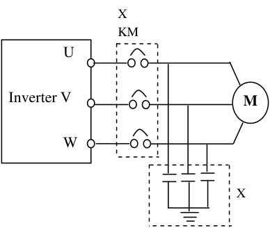

### 2. During the Power-up

**Danger**

- Do not plug the connectors of the inverter during the power up to avoid any surge into the main control board due to plugging, which might cause the damage of the inverter.
- Always have the protective cover in place before the power up to avoid electrical shock injury.

### 3. During the Operation

**Danger**

- Never connect or disconnect the motor set while the inverter is in running. Otherwise it will cause over-current trip and even burn up the main circuit of the inverter.
- Never remove the front cover of the inverter while the inverter is powered up to avoid any injury of electric shock.
- Do not come close to the machine when the fault restart function is used to avoid anything unexpected. The motor may automatically restart after its stop.
- The function of STOP Switch is only valid after setting, which is different with the use of emergent stop switch. Please pay attention to it when using it.

**Caution**

- Do not touch the heat sink, braking resistor, or other heat elements to avoid being scald.
- Be sure that the motor and machine is within the applicable speed ranges before starting operation because the inverter is quite easy to run from lower speed to higher speed.
- Do not check the signals on circuit boards while the inverter is running to avoid danger.
- Be careful when changing the inverter settings. The inverter has been adjusted and set before ex-work. Do not adjust it wantonly. Please make proper adjustments according to the required functions.
- Do consider the vibration, noise and the speed limit of the motor bearings and the mechanical devices when the inverter is running at or above the frequency of 50Hz.

## III. Standards and Specifications

### 1. Particular Specifications

|Type|Input Voltage|Power<br>(KW)|Inverter<br>Capacity<br>(KVA)|Output<br>Current<br>(A)|Suitable Motor<br>(KW)|
|---|---|---|---|---|---|
|HY00D423B|Single & Three Phase<br>220V 50Hz|0.4|1.0|2.5|0.4|
|HY0D7523B|Single & Three Phase<br>220V 50Hz|0.75|2.0|5.0|0.75|
|HY01D523B|Single & Three Phase<br>220V 50Hz|1.5|2.8|7.0|1.5|
|HY02D223B|Single & Three Phase<br>220V 50Hz|2.2|4.4|11|2.2|
|HY0D7543B|3Φ380V 50Hz|0.75|2.2|2.7|0.75|
|HY01D543B|3Φ380V 50Hz|1.5|3.2|4.0|1.5|
|HY02D243B|3Φ380V 50Hz|2.2|4.0|5.0|2.2|
|HY03D743B|3Φ380V 50Hz|3.7|6.8|8.5|3.7|
|HY05D543B|3Φ380V 50Hz|5.5|10|12.5|5.5|
|HY07D543B|3Φ380V 50Hz|7.5|14|17.5|7.5|
|HY001143B|3Φ380V 50Hz|11|19|24|11|
|HY001543B|3Φ380V 50Hz|15|26|33|15|
|HY18D543B|3Φ380V 50Hz|18.5|32|40|18.5|
|HY002243B|3Φ380V 50Hz|22|37|47|22|
|HY003043B|3Φ380V 50Hz|30|52|65|30|
|HY003743B|3Φ380V 50Hz|37|64|80|37|
|HY004543B|3Φ380V 50Hz|45|72|91|45|
|HY005543B|3Φ380V 50Hz|55|84|110|55|
|HY007543B|3Φ380V 50Hz|75|116|152|75|
|HY009043B|3Φ380V 50Hz|90|134|176|90|
|HY011043B|3Φ380V 50Hz|110|160|210|110|
|HY013243B|3Φ380V 50Hz|132|193|253|132|
|HY016043B|3Φ380V 50Hz|160|230|304|160|
|HY018543B|3Φ380V 50Hz|185|260|340|185|
|HY020043B|3Φ380V 50Hz|200|290|380|200|
|HY022043B|3Φ380V 50Hz|220|325|426|220|
|HY025043B|3Φ380V 50Hz|250|481|480|250|
|HY028043B|3Φ380V 50Hz|280|427|560|280|
|HY030043B|3Φ380V 50Hz|300|450|580|300|
|HY031543B|3Φ380V 50Hz|315|460|605|315|

### 2. General Specifications

|Inverter Series|HY-A|
|---|---|
|Control Mode|SPWM|
|Input Power|330~440Vfor 380Vpower；170~240for 220Vpower|
|5-Digits Display &<br>Status Indicator<br>Lamp|Displaying frequency, current, revolution, voltage, counter, temperature,<br>forward or reserve running, and fault, etc.|
|Communication<br>Control|RS-485|
|Operation<br>Temperature|-10~40℃|
|Humidity|0-95% Relative Humidity（without dew）|
|Vibration|Below 0.5G|
|Range|0.10~400.00Hz|
|Accuracy|Digital：0.01%（-10~40℃）,Analog：0.1%（25±10℃）|
|ol<br>Setting<br>Resolution|Digital：0.01Hz, Analog：1‰of Max. Operating Frequency|
|y Contr<br>Output<br>Resolution|0.01Hz|
|requenc<br>Operator Setting<br>Method|Press directly← ∧ ∨to set.|
|F<br>Analog Setting<br>Method|External Voltage 0-5V，0-10V，4-20mA，0-20mA.|
|Other Functions|Frequency lower limit, starting frequency, stopping frequency, three skip<br>frequencies can be respectivelyset.|
|RampControl|Selectable 4-speed steps ramp-upand -down time(0.1-6500s).|
|V/F Curve|Set V/F curve at will|
|Torque Control|Torque increase is settable by max. 10.0%. The starting torque can reach<br>150% at 1.0Hz.|
|al Control<br>Multi-Inputs|6 multi-function input terminals for 8–speed steps control, program operation,<br>switching of 4-speed Ramp, UP/DOWN function, counter, external<br>emergencystopand other functions.|
|Gener<br>Multi-Outputs|5 multi-function output terminals for displaying of running, zero speed,<br>counter, external abnormity, program operation and other information and<br>warnings.|
|Other Functions|AVR (auto voltage regulation), Deceleration stop or free-stop, DC brake, auto<br>reset and restart, frequency track, PLC control, traverse function, drawing<br>control,auto energy-savings,carrier adjustable bymax. 16KHz,etc.|
|<br> <br>Overload|Electronic relay protection motor|
|ection<br>ctions<br>Protection|Drive（for constant torque  150%/1 min. for the kinds of fan 120%/1min.）|
|Prot<br>Fun<br>FUSE<br>Protection|FUSE broken, Motor stops.|

|Over-voltage|DC Voltage＞400V for 220V class<br>DC Voltage＞800V for 380V class|
|---|---|
|Low Voltage|DC Voltage＜200V for 220V class<br>DC Voltage＜400V for 380V class|
|Instant Stop and<br>Restart|Restarted by frequency track after instantaneous stop.|
|Stall Prevention|Anti-stall duringAcc/Dec run|
|Output End<br>Shorts|Electronic circuit protecting|
|Other Functions|Fin over-heat protection, restriction of reverse running, direct start after power<br>on,fault reset, parameter lock PID,one-drive-more,etc.|

## IV. Storage and Installation

### 1. Storage

The inverter must be kept in its original package box before installation. Pay attention to the followings when keeping it in storage if the inverter is not used for the time being:

- It must be stored in a dry place without rubbish or dust.
- The suitable temperature for storage is between -20℃ and +65℃.
- The relative humidity required is 0-95% without condensation.
- There is no corrosive gas or liquid in the storage ambience.
- It’s better to lay the inverter on a rack and keep it in a proper package.
- It is better not to store the inverter for long time. Long time storage of the inverter will lead to the deterioration of electrolytic capacity. If it needs to be stored for a long time make sure to power it up one time within a year and the power-up time should be at least above five hours. When powered up the voltage must be increased slowly with a voltage regulator to the rated voltage value.

### 2. Installation Site and Environment

The inverter should be installed at the following location:

- Ambient temperature -5℃ to 40℃ with good ventilation.
- No water drop and low moisture.
- Free from direct sunshine, high temperature and heavy dust fall.
- Free from corrosive gas or liquid.
- Less dust, oil gas and metallic particles
- Free from vibration and easy for service and inspection.
- Free from the interference of electromagnetic noise.

   - **Attention: The ambient conditions of the inverter will affect its service life.**

### 3. Installation and Direction

- There must be enough space left around the inverter for easy maintenance and cooling. See Diagram .
- The inverter must be installed vertically with the smooth ventilation for effective cooling.
- If there is any instability when installing the inverter, please put a flat board under the inverter bottom base and install it again. If the inverter is installed on a loose surface, stress may cause damage of parts in the main circuit so as to damage the inverter.
- The inverter should be installed on non-combustible materials, such as iron plate.
- If several inverters are installed, upper and lower, together in one cabinet, please add heat dissipation plates and leave enough space between the inverters. See Diagram.

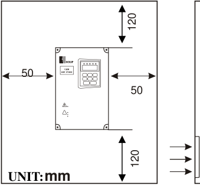

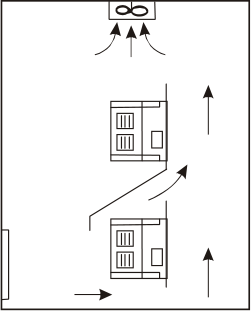

## V. Wiring

### 1. Main Circuit Wiring Schematic Diagram

Power supply:

- e Verify that the inverter’s rated voltage coincides with AC power supply voltage to avoid a damage of the inverter.

No fuse breaker:

- e Refer to the related list.

Ground fault circuit interrupter：

- e Use one of anti-high harmonic.

Electromagnetic contactor:

- e Note: Do not use the electromagnetic contactor as the on/off button of power supply for the inverter.

AC reactor:

- e It is recommended to install an AC reactor for power factor improvement if the input capacity is more than 1000KVA.

Inverter:

- e Be sure to make correct connections of the main circuit wires and control signal wires of the inverter.
- e Be sure to make correct setting of parameters for the inverter.

### 2. Description of Terminal Block

- 1）Arrangement of Main circuit Terminals

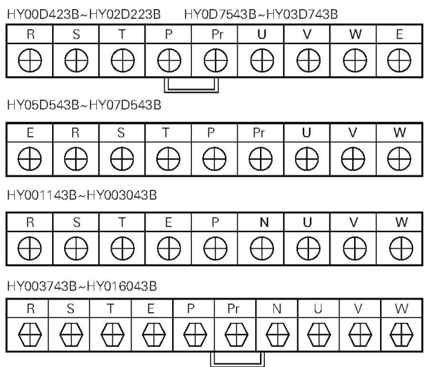

(2）Arrangement of Control Circuit Terminals

|UPF|DRV|DCM|SPL|SPM|SPH|RST||RE|V|FOR|FOR|||
|---|---|---|---|---|---|---|---|---|---|---|---|---|---|
||FA|FC|FB|

#### 3) Function Description of Main circuit Terminals

|Symbol|Function Description|
|---|---|
|R.S.T|Input terminal of AC line power.（110V and 220V class, for both single/three<br>phase,singlephase connected to anytwophases）|
|U.V.W|Output terminal of the inverter|
|P.Pr|Connector for brakingresistor.|
|P1P|Connector for DC reactor (When using a DC reactor the jumper shall be<br>removed. A05D543B and A07D543B internally jumped)|
|P、N|Connectingterminal of external brakingbank.|
|E|Ground terminal: the third method of grounding for 220V and special<br>groundingfor 380 V of Electrical EngineeringRegulations.|

4）Function Description of Control Circuit Terminals

|Symbol|Function Description|Factorysetting|
|---|---|---|
|FOR|Multi-Input 1|Forward run|
|REV|Multi-Input 2|Reverse run|
|RST|Multi-Input 3|Reset|
|SPH|Multi-Input 4|High speed|
|SPM|Multi-Input 5|Middle Speed|
|SPL|Multi-Input 6|Low Speed|
|DCM|Common Terminal of Digital and Control<br>Signals, +12v Power,（EV、IPV、P24）<br>Ground||
|EV（IPV）|+12V Power Supply|Max. output current  200mA|
|P24|+12V Power Supply|Max. output current  200mA|
|+10|Power Supplyfor Speed Setting|+10V|
|VI|Analog Voltage Frequency Reference<br>Input|0~+10V<br>corresponding<br>to<br>the<br>highest operatingfrequency|
|AI|Analog Current Frequency Reference<br>Input|4~20mA<br>corresponding<br>to<br>the<br>highest operatingfrequency|
|ACM|Common Terminal of Analog and Control<br>Signals||
|DRV|Multi-Output 1(Optical couple output)|DC24V/100A|
|UPF|Multi-Output 2(Optical couple output)|m|
|FA（EFA）、<br>FB（EFB）、<br>FC（EFC）|Multi-Output 3 (N/O or N/C)|3A/250VAC|
|KA（EKA）、<br>KB（EKB）|Multi-Output 4 (N/O)|3A/250VAC|
|AM|Output terminals of digital frequency|0~10V|
|RS+ RS-|RS485 Communicationport||

### 3. Basic Connection Diagram

The wiring of the inverter is divided into two parts, main circuit terminal connections and control circuit terminal connections. The user can see the main circuit terminals, and the control circuit terminals after removing the cover of enclosure. The terminals must be connected correctly as the following wiring circuit diagrams.

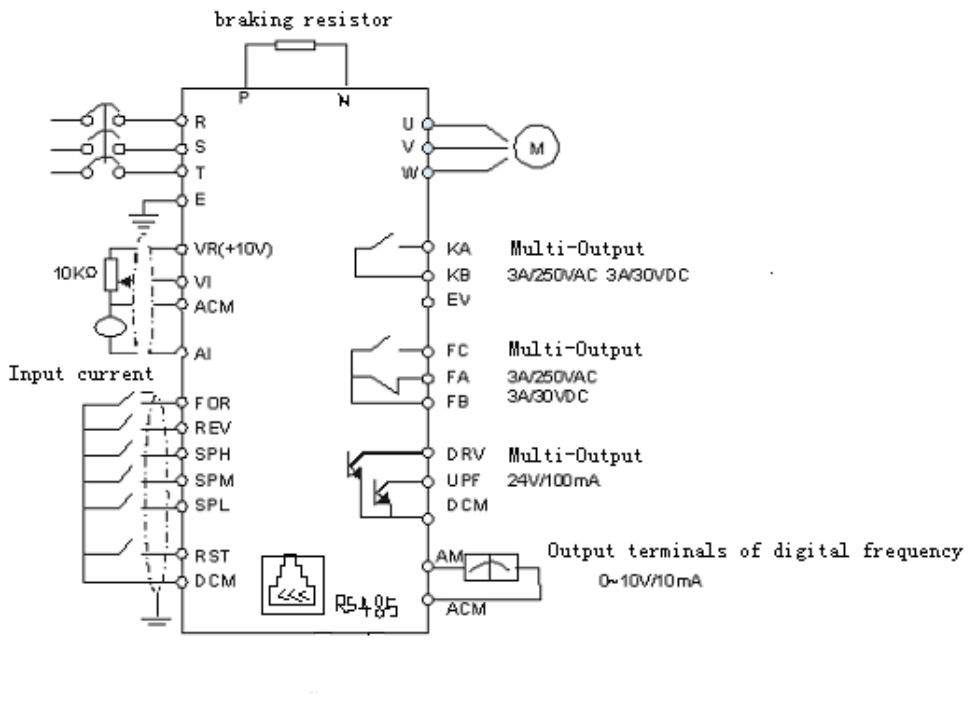

### 4. Precautions on Wiring

- 1) For the main circuit wiring:
- e While wiring the sizes and specifications of wires should be selected and the wiring should be executed according to the electrical engineering regulations to ensure the safety.
- e It is better to use shielded wire or wire and conduit for power cord and ground the shielded layer or two ends of wire conduit.
- e Be sure to install a Non Fuse Breaker (NFB) between the power supply and the input terminals (R.S.T). (If using ground fault circuit interrupter, please choose one corresponding to high frequency)
- e Never connect AC power to the output terminal (U.V.W) of the inverter.
- e Output wires mustn’t be in touch of the metal part of the inverter enclosure, or it will result in earth short-circuit.
- e Phase-shifting capacitors, LC, RC noise filters, etc, can never be connected to the output terminals of the inverter.

- The main circuit wire must be enough far away from other control equipments.
- When the wiring between the inverter and the motor exceeds 15 meters for 220V class or 30 meters for 380V class, much higher dV/dT will be produced inside the coil of the motor, which will cause the destruction to the interlay or insulation of the motor. Please use a dedicated AC motor for the inverter or add a reactor at the inverter.
- Please lower the carrier frequency when there is a longer distance between the inverter and the motor. Because the higher the carrier frequency is the bigger the leakage current of high-order harmonics in the cables will be. The leakage current will have unfavorable effect on the inverter and other equipment.
- 2） For control circuit wiring (signal line)
- The signal line should be separately laid in a different conduit with the main circuit wire to avoid any possible interference.
- Please use the shielded cable with the size of 0.5-2mm<sup>2</sup> for signal lines.
- Use the control terminals on the control panel correctly according to your needs.
- 3） Grounding
- Grounding terminal E. Be sure to make correct grounding 220V class: The third grounding method (Grounding resistance should be 100Ω or lower.) 380V class: The special third grounding method (Grounding resistance should be 10Ω or lower.)
- Choose grounding wires according to the basic length and size of the technical requirements of the electric equipment.
- Do avoid sharing grounding wire with other large power equipment such as electric welder, power machine, etc. The grounding wire should be kept away from the power supply wires for large power equipment.
- The grounding method for several inverters together should be done as the first and second diagrams below. Avoid the third loop.
- The grounding wire must be as shorter as possible.


（1）Good （2）Good （3）Not good

## VI. Instruction of the Digital Operator

### 1. Description of the Digital Operator

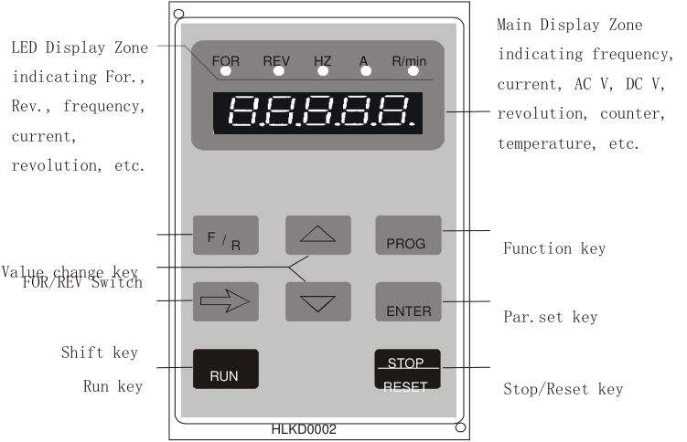

### 2. Description of Indicator Lamp Status

#### 1) Description of Indicator Lamp Status

|Indicator lamp|Status|Description|
|---|---|---|
|FOR|on|The motor is in forward rotation.|
|REV|on|The motor is in reverse rotation.|
|HZ|on|Displaying set frequency or output frequency.|
|A|on|Displayin~~g o~~utput current.|
|ROTT|on|Displaying rated motor revolution<br>RUN|
|A  ROTT|on|Displaying AC or DC voltage.|
|HZ  ROTT|on|Displaying counting value.|
|HZ A ROTT|on|Displaying internal temperature of the inerter.|

#### 2) Description of Display Items

|Display|Indic.lamp|<br>on|Meaning|
|---|---|---|---|
|||Present|output frequency is 50.00HZ|
|||Present|set frequency is 50.00HZ|
|||Present|3.0A<br>output current is|
|||Present|1440r/min<br>output revolution is|
|||Present|510.1V<br>DC voltage is|
|||Present|380.0V<br>AC voltage is|
|||Present|inverter’s temperature is 35.0℃|
|||Present|counter’s value is 105|
|||Present|target value of PID is 50.0%|
|||I<br>Present|feedback value of PID is 48.0%|
|||Present|time of power-on is 12 hours|
|||Total r|un time of inverter is 108 hours|

### 3. Description of Operation Examples

|Procedures|Display|Indic<br>La|ator<br>mp|Explanation|
|---|---|---|---|---|
|Power up,|Dsp2.0 flash||||
|Operation of<br>power|Vr2.00<br>000.00|FOR<br>¢|HZ<br> ¤|Self detect when power-up, display<br>version no. (Flashing) and finally set<br>frequency.|
|PROG|PD000|FOR<br>¢|HZ<br> ¤|Enter programming<br>Displaythe function of PD000|
|ENYER|000.00|FOR<br>¢|HZ<br> ¤|Display the contents of PD000|
|ENTER<br>PROG|50.00<br>END    50.00<br>PD001<br>050.0|FOR<br>¢<br>FOR<br>¢|HZ<br> ¤<br>HZ<br> ¤|Change the content of PD000<br>Confirm changed value.<br>Display END  50.00  PD001<br>Back fromprogramming|
|RUN|50.00|FOR<br>¤|HZ<br> ¤|Display running and operating<br>frequency|
|DISP|50.00<br>0.00~~5~~0.00|FOR<br>¤|HZ<br> ¤|Monitor screen switching, display<br>output current|
|PROG|005.0|FOR<br>¤|HZ<br> ¤|Monitor screen switching, display<br>output current|
|DISP|01440|FOR<br>¤|A<br> ¤|Monitor screen switching, display<br>revolution|
|PROG|50.00|FOR R<br>¤|OTT<br> ¤|Switch back to main screen, display set<br>frequency|
|F/R|~~5~~0.00|FOR<br>¤|HZ<br> ¤|Switch of For.Rev. rotation, display the<br>status of Rev rotation|
|050.0|FOR<br>¤|HZ<br> ¤|Switch to adjustable frequency|
|030.00|FOR<br>¤|HZ<br> ¤|Adjust set frequency, i.e. the value of<br>PD000|
|030.00|FOR<br>¤|HZ<br> ¤|Confirm changed value, write to<br>PD000 as value|
|~~3~~0.00|FOR<br>¢|HZ<br> ¤|Stop|

**Note:**

- ① ¢ means flashing. ¤ means bright.
- ②For monitoring AC, DC, T and other items they can be only switched and displayed after the parameter setting.
- ③ When it is powered up again after a power breakdown the inverter will display the screen previous to  the power breakdown after its self detection.

## VII. Commissioning

### 1. Important Checks before the Commissioning

- If there is any wrong connected wires? Pay special attention to the terminal of U.V.W; Make sure the power supply wires are connected to R.S.T, not U.V.W.
- If there is any metal powder or wires left on the base plate of the inverter or the terminal block, which may cause short circuit.
- If screws are tightly locked and if the connecting parts are loose.
- If there is any short circuit or earth fault at outputs.

### 2. Commissioning Methods

The procedure of the operator is factory set up for the control mode of HY series. The commissioning can be carried out through the digital operator. Generally, the commissioning can be conducted at 5.00 Hz.

|Procedures|Display|Indicator Lamp|Explanation|
|---|---|---|---|
|Power up<br>↓|dsp1.1→Vr2.0<br>000.0|FOR  Hz<br> ¢ ¤|Self detect when power up,<br>display version no. and finally<br>set frequency|
|△|000.00|FOR  Hz<br> ¢  ¤|Switch to adjustable<br>frequencyon thepanel|
|↓<br>←△|050.00|FOR  Hz<br> ¢  ¤|Change set frequency, i.e. the<br>value of PD003|
|↓<br>ENTER|50.00|FOR  Hz<br> ¢  ¤|Confirm changed value|
|↓<br>RUN|50.00|FOR  Hz<br>¤ ¤|Run at 50Hz|
|↓<br>STOP|50.00|FOR  Hz<br> ¢  ¤|Stop|

Note: ¤ means indicator lamps is on;   ¢  means indicator lamps flash;

## VIII. Function List

|Code|Function|Set Range & Function Explanation|Factory<br>Setting|
|---|---|---|---|
|PD000|Parameter Lock|0：Invalid   1：Valid|0|
|PD001|Source of Run<br>Commands|0：Operator    1：External terminal<br>2：Communicationport|0|
|PD002|Source of Operating<br>Frequency|0：Operator    1：External terminal<br>2：Communicationport|0|
|PD003|Main Frequency|0.00~400.00 Hz|0.00|
|PD004|Base Frequency|0.01~400.00 Hz|50.00|
|PD005|Max Operating<br>Frequency|50.00~400.00 Hz|50.00|
|PD006|Intermediate Frequency|0.01~400.00 Hz|2.50/3.0|
|PD007|Min. Frequency|0.01~20.00 Hz|0.50|
|PD008|Max. Voltage|0.1V—*|220/380|
|PD009|Intermediate Voltage|0.1V—*|*|
|PD010|Min. Voltage|0.1~50.0V|*|
|PD011|FrequencyLower Limit|0.00~400.00 Hz|0.00|
|PD012|Reserved|||
|PD013|Parameter Reset|00~10  08：Restore the factory<br>setting. No other function.|00|
|PD014|Accel. Time 1|0.1~6500.0S|*|
|PD015|Decel. Time 1|0.1~6500.0S|*|
|PD016|Accel. Time 2|0.1~6500.0S|*|
|PD017|Decel. Time 2|0.1~6500.0S|*|
|PD018|Accel. Time 3|0.1~6500.0S|*|
|PD019|Decel. Time 3|0.1~6500.0S|*|
|PD020|Accel. Time 4|0.1~6500.0S|*|
|PD021|Decel. Time 4|0.1~6500.0S|*|
|PD022|Reserved|||
|PD023|Rev. Rotation Select|0: Rev Run forbidden; 1：Rev Run<br>Enable|1|
|PD024|STOP keyselect|0：STOP Invalid 1：STOP Valid|1|
|PD025|Starting Mode|0：Start from Starting Frequency<br>1：Frequencytrack start|0|
|PD026|Stopping Mode|0：Decelerating stop<br>1：Coastingstop|0|
|PD027|StartingFrequency|0.1~10.0 Hz|0.5|
|PD028|StoppingFrequency|0.1~10.0 Hz|0.5|

||DC Braking level<br>|||
|---|---|---|---|
|PD031|DC Braking time at<br>start|0.0~20.0%|2.0|
|PD029|<br>DC Brakin time at|0.0~25.0S|0.0|
|PD030|g<br>sto|0.0~25.0S|0.0|
|PD032|p<br>F tk ti|0.0~20.0S|5.0|
|PD033|requency rac me<br>Current<br>level<br>for<br>frequencytrack|0~200%|150|
|PD034|Voltage rise time during<br>frequency track||0.5|
|PD035-PD<br>040|Reserved|||
|PD041|Carrier frequency|0~15|*|
|PD042|JoggingFrequency|0.00~400.00 Hz|5.00|
|PD043|S-Curve Time|0~6500S|0|
|*PD044|Multi-input 1(FOR)|0: Invalid; 1:Run; 2:  For rotation; 3:|02|
|*PD045|Multi-input 2(REV)|Rev rotation; 4: Stop; 5: FOR/REV.; 6:|03|
|*PD046|Multi-input 3(RST)|Jog; 7: Jog For rotation; 8: Jog Rev|14|
|*PD047|Multi-input 4(SPH)|Rotation; 9: Emergent stop; 10: Reset;<br>|22|
|*PD048|Multi-input 5(SPM)|11:Reserved; 12: Overheat of heat<br>|23|
|*PD049|Multi-input 6(SPL)|sink or motor; 17: High speed; Middle<br>speed; 19: Low speed; 20:<br>Multi-speed 1; 21: Multi-speed 2; 22:<br>Multi-speed 3; 23: Ramp select 1; 24:<br>Ramp select 2; 25: UP function; 26:<br>DOWN function; 27: Counter 28:<br>Counter reset; 29: Drawing; 32: PID<br>Start|24|
|*PD050|Multi-output 1(DRV)|0: Invalid; 1: Run; 2: Fault indication;<br>3: Zero Speed; 4:  Braking<br>indication; 5: Set Frequency reach; 6:<br>ArbitraryFrequency1 reach;|01|
|*PD051|Multi-output 2(UPF)||05|
|*PD052|Multi-output<br>3(Terminals of<br>FA,FB,FC)||02|

|*PD053|Multi-output<br>4(Terminals of KA,KB)|7: Arbitrary Frequency 2 reach; 8: In<br>Accel.; 9: In Decel.; 10: Inverter<br>Overload alarm; 11: Motor Overload<br>alarm; 12: Over-torque alarm; 13:<br>Low voltage alarm; 14: Single stage<br>end indication; 15: Process end<br>indication; 16: Counter reach; 27:<br>Drawing reach;  28:PID lower limit<br>alarm; 29: PID upper limit alarm; 30:<br>Fan act; 31: Reserved; 32: Braking<br>resistor act|00|
|---|---|---|---|
|PD054|Multi-output 5(AM)|Output of digital frequencysignals|0|
|PD055|AM<br>Analog<br>output<br>Gain|0.0~100.0%|100|
|PD056|SkipFrequency1|0.00~400.00 Hz|0.00|
|PD057|SkipFrequency2|0.00~400.00 Hz|0.00|
|PD058|SkipFrequency3|0.00~400.00 Hz|0.00|
|PD059|SkipFrequencyRange|0.00~2.00 Hz|0.5|
|PD060|Uniform Frequency1|0.00~400.00 Hz|0.00|
|PD061|Uniform Frequency2|0.00~400.00 Hz|0.00|
|PD062|Uniform<br>Frequency<br>Range|0.10~10.00 Hz|0.50|
|PD063|Timer 1 time|0~10.0|0.01|
|PD064|Timer 2 time|0~100|0.01|
|PD065|Countingvalue set|00~65500|00|
|PD066|Intermediate Counter|0~65500|0|
|PD067-PD<br>069|Reserved|||
|PD070|AnalogInput|0~10|0|
|PD071|Analog<br>Filtering<br>Constant|0~50|20|
||Lower Analog|||
||Frequency Bias|0.00~400.00 Hz||
|PD073|Direction at Lower|0：Positive direction  1：Negative|0|
|PD075|Frequency|direction|0|
||Higher<br>Analog|0.00~400.00 Hz|50.00|
|PD072|Frequency|0：Positive direction  1：Negative|0|
|PD074|Bias Direction at|direction||
||<br>Higher Frequency|||
|PD076|Analog Negative Bias<br>Reverse|0：Not allowable.    1：Allowable.|0|
|PD077|Up/Down Function|0：Not memorized  1：Memorized|1|
|PD078|Up/Down Speed|0：0.01HZ   1：0.1HZ|0|

|PD079<br>PD080|Reserved<br>PLC Operation|0：Normal run; 1: External control 4<br>-speed; 2:External control<br>multi-speed; 3: Disturbance; 4:<br>Internal control multi-speed; 5:<br>Drawing|0|
|---|---|---|---|
|PD081|AutoPLC|0：Stop after running for one cycle; 1：<br>Cycling run; 2：Auto stop after<br>running for one cycle (STOP for<br>intervention); 3: Auto Run and<br>Cycling (STOP for intervention)|0|
|PD082|PLC rotation Direction|0~255（0：For   1：Rev）|0|
|PD083||0~255（0：For   1：Rev）||
|PD084|PLC RampTime|0~65535|0|
|PD085||0~65535||
|PD086|Frequency 2|0.00-400.00 Hz|15.00|
|PD087|Frequency 3|0.00-400.00 Hz|20.00|
|PD088|Frequency 4|0.00-400.00 Hz|25.00|
|PD089|Frequency 5|0.00-400.00 Hz|30.00|
|PD090|Frequency 6|0.00-400.00 Hz|35.00|
|PD091|Frequency 7|0.00-400.00 Hz|40.00|
|PD092|Frequency 8|0.00-400.00 Hz|0.50|
|PD093|Frequency 9|0.00-400.00 Hz|10.00|
|PD094|Frequency 10|0.00-400.00 Hz|15.00|
|PD095|Frequency 11|0.00-400.00 Hz|20.00|
|PD096|Frequency 12|0.00-400.00 Hz|25.00|
|PD097|Frequency 13|0.00-400.00 Hz|30.00|
|PD098|Frequency 14|0.00-400.00 Hz|35.00|
|PD099|Frequency 15|0.00-400.00 Hz|40.00|
|PD100|Frequency16|0.00-400.00 Hz|45.00|

|PD101|Timer 1|0.0-6500.0S|10.0|
|---|---|---|---|
|PD102|Timer 2|0.0-6500.0S|10.0|
|PD103|Timer 3|0.0-6500.0S|0.0|
|PD104|Timer 4|0.0-6500.0S|0.0|
|PD105|Timer 5|0.0-6500.0S|0.0|
|PD106|Timer 6|0.0-6500.0S|0.0|
|PD107|Timer 7|0.0-6500.0S|0.0|
|PD108|Timer 8|0.0-6500.0S|0.0|
|PD109|Timer 9*|0.0-6500.0S|0.0|
|PD110|Timer 10|0.0-6500.0S|0.0|
|PD111|Timer 11|0.0-6500.0S|0.0|
|PD112|Timer 12|0.0-6500.0S|0.0|
|PD113|Timer 13|0.0-6500.0S|0.0|
|PD114|Timer 14|0.0-6500.0S|0.0|
|PD115|Timer 15|0.0-6500.0S|0.0|
|PD116|Timer 16|0.0-6500.0S|0.0|
||||Factory|
|Code|Functions|Set Range & Function Explanation|<br>Setting|
|PD117|AutoPLC Memory|0~1|0|
|PD118<br>PD119|Over-voltage Stall<br>Prevention<br>Stall Prevention Level<br>at Accel.|0：Invalid   1：Valid<br>0~200%|1<br>150|
|PD120|<br>Stall Prevention Level|0~200%|0|
|PD122|at Constant Speed<br>Stall Prevention Level<br>|0~200%|150|
||at Decel.|||
|PD123|Over-torque Detect<br>Mode|0~3|0|
|PD124|Over-torque Detect<br>Level|0~200%|0|
|PD125|Over-torque Detect<br>Time|0.1~20.0S|1.0|
|PD127-PD<br>129|Reserved|||
|PD130|Number of Auxiliary<br>Pump|0~2|0|
|PD131|Continuous Operating<br>Time of Aux. Pumps|1~9000mim|1|

|PD132|Interlocking Time of<br>Aux. Pumps|1~250s|5s|
|---|---|---|---|
|PD133|High Speed Running<br>Time|1~250s|60s|
|PD134|Low Speed Running<br>Time|1~250s|60s|
|PD135|StoppingVoltage Level|1~150%|95%|
|PD136|Lasting Time of<br>StoppingVoltage Level|1~250s|30s|
|PD137|WakeupLevel|1~150%|80%|
|PD138|SleepFrequency|0.00~400.0|20.00|
|PD139|Lasting Time of Sleep<br>Frequency|1~250s|20s|
|PD140|Reserved|||
|PD141<br>PD142<br>PD143<br>PD144|Rated Motor Voltage<br>Rated Motor Current<br>Motor pole number.<br>Rated Motor<br>Revolution|Set according to Motor nameplate<br>Set according to Motor nameplate<br>02—10<br>00—9999|*<br>*<br>04<br>1440|
|PD145|Auto Torque<br>Compensation|0.1—10.0 %|2.0%|
|PD146|Motor no-load current|0—99|40|
|PD147|Motor slip<br>compensation|0.0—10.0|0.0|
|PD148-PD<br>149|Reserved|||
||Restart after<br>Instantaneous Stop|||
|PD153<br>PD154<br>PD155<br>PD150<br>PD151|Allowable<br>Power-Breakdown<br>Time<br>Number of Abnormal<br>Restart<br>Auto Voltage<br>Regulation<br>Auto EnergySaving|0：Invalid  1：Frequency track<br>0.1~5.0S<br>0—10<br>0：Invalid   1：Valid<br>0~10%|0<br>0.5<br>00<br>1<br>0|

|PD156|Proportional Constant<br>(P)|0.0~1000.00%|100%|
|---|---|---|---|
|PD157|<br>Interal Time (I)|0.1~3600.00S|5.0|
|PD158|g<br>Differential Time (D)|0.01~10.00S|0|
|PD159|<br>Taret value|0.0~100.0%|0|
|PD160|g<br>Target value select|0: set by the operator  1：set by<br>external terminals（0-10V）|0|
|PD161|PID uer limit|0~100%|100%|
|PD162|pp<br>PID lower limit|0~100%|0%|
|PD163|Communication<br>Addresses|0-250|0|
|PD164|Communication Baud<br>Rate|0-3|1|
|PD165|<br>Communication Data<br>Method|0-5|0|
|PD170|Display Items|0-5||
|PD171|Display Items Open|0-7|0|
|PD166|Voltage Rating of<br>Inverter|Set according to the model|0<br>*|
|PD174|Rated Current of<br>Inverter|Set according to the model|*|
|PD181|Software Version||*|
|PD177|Fault Record 1||——|
|PD178|Fault Record 2||——|
|PD179|Fault Record 3|Note:——means no fault record.|——|
|PD180|Fault Record 4||——|
|PD172|Fault Clear|00—10（01 for Fault Clear）|00|
|PD175|Inverter Model|||
|PD176|Inverter Frequency<br>Standard|0：50Hz  1：60Hz|0|
|PD182|Manufacture Date|Year：Month：Week|*|
|PD183|Serial No.||*|

## IX. Descriptions of Functions

#### PD000 Parameter Lock

*Set Range: 0—1 · Unit: 1 · Factory Setting: 0*

- 0: Invalid.
- 1: Valid, i.e. the parameters are locked. Except this parameter other parameters can not be changed.

This parameter is set to prevent non-maintenance personnel from setting other parameters by mistake. After the parameters are locked the operating frequency can be changed by pressing △ or ▽.

#### PD001 Source of Operation Commands

*Set Range: 0—2 · Unit: 1 · Factory Setting: 0*

- 0: Set by the Operator

Operation commands are given via the digital operator.

- 1: Set by external terminals.

Operation commands are given via external terminals, i.e. multi-input terminals

- 2: Set by communication ports.

Operation commands are given via communication ports.

#### PD002 Source of Operating Frequency

*Set Range: 0—2 · Unit: 1 · Factory Setting: 0*

- 0: Set by the operator.  Operating frequency is given via the digital operator.
- 1: Set by external terminals. Operating frequency is controlled by analog signals input via external terminals. The signal type is determined by PD070. For the related parameters refer to PD070-PD076.
- 2: Set by communication ports. Operating frequency is given via the serial communication.

#### PD003 Main Frequency

*Set Range: 0.00—400.00 Hz · Unit: 0.01 Hz · Factory Setting: 0.00*

In the digital operator mode, the inverter will run at the set value of PD003. During running, the

operating frequency can be changed by pressing ▲ or ▼. During multi-speed running, the main frequency is taken as the frequency of Speed 1.

In the external control multi-speed mode, if PD002 is set to 1, i.e. given by an external terminal, Speed 1 will be given by the analog of the external terminal.

The setting of main frequency is limited by the maximum operating frequency.

The related parameters of PD002, PD080 are adjustable during operation.

#### PD004 Base Frequency

*Set Range: 0.01—400.00 Hz · Unit: 0.1Hz · Factory Setting: 50.00*

This parameter must be set according to the rated frequency of operating voltage on the motor’s nameplate. Under normal conditions do not change the set value of base frequency at will. If it is equipped with a special motor this value should be set properly according to the characteristics of the motor’s parameters. Otherwise it may cause the damage to the equipment.

#### PD005 Max. Operating Frequency

*Set Range: 10.00—400.00 Hz · Unit: 0.01 Hz · Factory Setting: 50.00*

This parameter is set for the maximum operating frequency of the inverter.

The following are several curves and set values often used for reference. Specific curves must be set according to concrete characteristics of mechanical load.

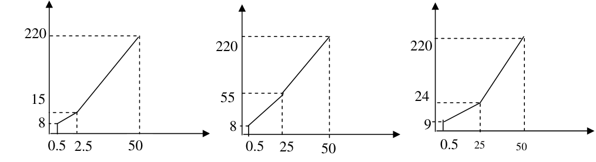

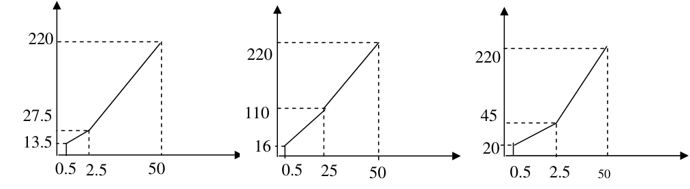

Curve of constant torque           Curve of lower torque   Curve of higher torque

#### PD006 Intermediate Frequency

*Set Range: 0.01—400.00 Hz · Unit: 0.01 Hz · Factory Setting: 2.50*

Note: **** means this parameter is adjustable during operation.**

This parameter is set for intermediate frequency of arbitrary V/F curve. If it is set improperly, it will cause over-current or under-torque of the motor, or even tripping of the inverter.

This set value of intermediate frequency is limited by the set value of base frequency.

#### PD007 Min. Frequency

*Set Range: 0.1—20.00 Hz Unit: 0.01 Hz Factory Setting: 0.50*

This parameter is set for the min. starting frequency of V/F curve.

The following table has specific factory settings of V/F curve, accel./decal., time and carrier for the inverter of A series:

#### PD008 Max. Voltage

*Set Range: 0.1—* · Unit: 0.1V · Factory Setting: 220/380V*

This parameter should be set according to the rated value of the motor’s nameplate. The factory setting is 380V for 380V class motor and 220V for 220V class motor. The setting range of this parameter is restricted by the voltage rating of the inverter. In case of the motor relatively far away

from the inverter this set value can be increased properly.

#### PD009 Intermediate voltage

*Set Range: 0.1—500.0V · Unit: 0.1V · Factory Setting: 15/27.5*

This parameter is set for an intermediate voltage value of arbitrary V/F curve. If it is set improperly, it will cause over-current or under-torque of the motor, or even tripping of the inverter. When the intermediate frequency is increased the voltage will increase the output torque and at the same time also the output current. When changing this parameter please pay attention to monitoring the output current to avoid the inverter’s tripping due to over-current.

The factory setting of intermediate voltage for 220V class inverter is 15, while the factory setting of intermediate voltage of 380V class inverter is 27.5.

This set value of intermediate voltage is limited by the set value of max voltage.  When the voltage is increasing to a certain value at intermediate frequency the torque compensation will lose its function. When adjusting this parameter the output current of the inverter should be increased from low to high slowly according to the load of machines until it meets the starting requirement. Do not be quick to increase it by large amplitude. Otherwise it might cause the tripping of the inverter or the damage of the machines.

#### PD010 Min. Voltage

*Set Range: 0.1—50.0V Unit: 0.1V Factory Setting: **

This parameter is set for the min. starting voltage of V/F curve.

The factory setting of min. voltage for 220V class inverters is 8, and the factory setting of min.voltage for 380V class inverters is 13.5.

This set value is limited by the voltage at the max. frequency.

|Model|PD009|PD010|PD008|PD015|PD041|Model|PD009|PD010|PD008|PD015|PD041|
|---|---|---|---|---|---|---|---|---|---|---|---|
|A00D423B|15.0|7.5|5|5|9|A003043B|17|8.5|30|30|4|
|A0D7523B|14.0|7|8|8|9|A003743B|16|8|35|35|4|
|A01D523B|14.0|7|10|10|8|A004543B|16|8|40|40|4|
|A02D223B|13.0|6.5|10|10|8|A005543B|15|7.5|45|45|3|
|A03D723B|13.0|6.5|15|15|7|A007543B|15|7.5|50|50|3|
|A05D523B|12.0|6.0|15|15|6|A009043B|14|7|75|75|2|
|A07D523B|11.0|5.5|20|20|6|A011043B|14|7|100|100|2|
|A001123B|10.0|5.0|25|25|5|A013243B|13|6.5|150|150|2|
|A001523B|10.0|5.0|30|30|5|A016043B|13|6.5|150|150|2|
|A18D523B|9.0|4.5|35|35|5|A018543B|12|6|200|200|2|
|A002223B|9.0|4.5|50|50|4|A020043B|12|6|200|200|2|
|A0D7543B|22|11|8|8|9|A022043B|11|5.5|250|250|2|
|A01D543B|22|11|10|10|8|A025043B|11|5.5|250|250|2|
|A02D243B|21|10.5|15|15|8|A028043B|11|5.5|250|250|2|
|A03D743B|21|10.5|15|15|7|A030043B|10|5|250|250|2|
|A05D543B|20|10|15|15|6|A031543B|10|5|250|250|2|
|A07D543B|20|10|20|20|6|A034543B|10|5|250|250|2|
|A001143B|19|9.5|20|20|5|A037543B|10|5|250|250|2|

|A001543B|19|9.5|20|20|5|A040043B|10|5|250|250|2|
|---|---|---|---|---|---|---|---|---|---|---|---|
|A18D543B|18|9|25|25|5|A041543B|10|5|250|250|2|
|A002243B|18|9|25|25|5|||||||

Note: ① Ramp Time 2 = Ramp Time 1 x 2

- Ramp Time 3 = Ramp Time 2 x 2
- ③ Ramp Time 4 = Ramp Time 3 x 2
- ④ Min.Voltage Value = Intermediate Voltage Value/2
- ⑤ The intermediate frequency is 2.5 for the system of 50Hz.
- ⑥ The intermediate frequency is 3.0 for the system of 60Hz.

#### PD011 Frequency Lower Limit
*Set Range: 0.00—400.00 · Unit: 0.01 Hz · Factory Setting: 0.00*

This is set for preventing workers from false operation to avoid over-heat or some other mechanical faults, which might be caused due to too low operating frequency. The setting of Frequency Lower Limit must be less than the set value of Frequency Upper Limit.

#### PD012 Reserved

#### PD013 Parameter Reset

ge：00—10             Unit：1          Factory Setting：00

When the value for a parameter is set improper or is abnormal for some reasons this parameter can be set to 08 to restore it to the factory setting and then reset. After the parameters are locked (in case of PD000=1) the parameters can’t be reset. They can only be reset after unlock. For related parameters refer to PD000.

|PD014Accel. Time 1|||**|
|---|---|---|---|
|Set Range：0.1—6500.0S|Unit：|0.1S|Factory Setting：*|
|PD015  Decel. Time 1|||**|
|Set Range：0.1—6500.0S|Unit：|0.1S|Factory Setting：*|
|PD016  Accel. Time 2|||**|
|Set Range：0.1—6500.0S|Unit：|0.1S|Factory Setting：*|
|PD17 Decel. Time 2|||**|
|Set Range：0.1—6500.0S|Unit：|0.1S|Factory Setting：*|
|PD18 Accel. Time 3|||**|
|Set Range：0.1—6500.0S|Unit：|0.1S|Factory Setting：*|
|PD019  Decel. Time 3|||**|
|Set Range：0.1—6500.0S|Unit：|0.1S|Factory Setting：*|
|PD020  Accel. Time 4|||**|
|Set Range：0.1—6500.0S|Unit：|0.1S|Factory Setting：*|
|PD021  Decel. Time 4|||**|
|Set Range：0.1—6500.0S|Unit：|0.1S|FactorySetting：*|

Ramp-up time means the time needed for the inverter to increase the frequency from 0Hz to the maximum operating frequency (See t1 in the diagram). Ramp-down Time means the time needed

for the inverter to decrease the frequency from the maximum operating frequency to 0Hz (See t2 in the diagram).

F Max Oper. F. t1 t2

**Note:**

**The versions previous to Vr2.0 took 50Hz as the base of ramp time.**

HY-A Series inverter have altogether 4 Ramp Times. For Ramp Time 2.3.4 the user can select the different ramp up or down time through the external terminals or switching of ramp time according to the actual needs. In the internal control multi-speed operation, different ramp time can be selected through easy PLC.

Generally the default of the inverter is Ramp Time 1, which is factory set depending on the model. Ramp Time 4 is for the jogging ramp time. For the factory setting of parameters refer to the table in PD007.

The related parameters: PD044~PD049 and P084~PD085

P022         Factory Reserved

#### PD023 Rev Rotation Select

*Set Range: 0—1 · Unit: 1 · Factory Setting: 1*

- 0: Rev Rotation disable
- 1: Rev Rotation Enable

This function is suitable for the motor, which is not allowed to rotate reversely, to prevent workers from false operation. When the reverse rotation is disabled, the motor can only rotate forward, not reverse.

#### PD024 STOP key

*Set Range: 0—1 · Unit: 1 · Factory Setting: 1*

- 0: STOP invalid.
- 1: STOP valid.

This parameter set is only valid when PD001 is set to l or 2.

When the control mode is set for external terminals or communication control, STOP key on the panel can be chosen to be valid or invalid. When choosing it as valid, STOP key can stop the inverter in running. When it needs to restart, the former running signal must be released before restarting the inverter.

#### PD025 Starting Mode

*Set Range: 0—1 Unit: 1 Factory Setting: 0*

Two starting modes are available for the needs of different equipment.

**0：Start from the starting frequency.**

When PD029 is set to 0, i.e. DC braking is invalid at start, it starts running from the starting frequency. When PD029 is set to any non-zero value, i.e. DC braking is valid at start, itl first performs a DC braking at start, and then starts from the starting frequency. For the related parameters refer to PD035, PD031 and PD029.

- 1: Start by frequency track

This setting can be used for the restarting of large inertia load. When restarting, the inverter will trace the former frequency from the set frequency downward. In case of large inertia equipment, when restarting, it can implement the running command and track the former frequency right away without waiting for the complete stop of the equipment to save time.

**Note:** When the inverter is restarted by frequency track, it will start tracking the frequency from its set frequency downward, and search it at the highest speed. When restarting, the current becomes higher, and over-current or stall may occur. So attention must be paid to the adjustment of current level of frequency track. Generally, PD033 is adjusted around 100. The concrete value can be set according to the characteristics of mechanical load.

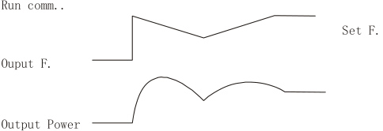

**PD026 Stopping Mode Set Range：0—1 Unit：1 Factory Setting：0**

Two stopping modes are available for the needs of different equipment.

- 0: Decelerating Stop

When PD030 is set to 0, DC braking is invalid. When DC braking is invalid, the inverter will decelerate to the stopping frequency, and then stop outputs, and the motor will coast to stop. When PD030 is set to any non-zero value, DC braking is valid, and the inverter will first decelerate to the stopping frequency, and then stop by DC braking.

DC braking at stop is usually used for high position stop or for positioning control. It must be noticed that frequent uses of DC braking will cause over-heat of the motor.

For the related parameters refer to PD028, PD031 and PD030.

**1：Coasting Stop**

When the inverter receives a STOP command, it will immediately stop output and the motor will coast to stop. When the coasting stop mode is selected, DC braking is invalid.

#### PD027 Starting Frequency

*Set Range: 0.1—10.0 Hz · Unit: 0.1Hz · Factory Setting: 0.5 Starting frequency is the initial frequency when the inverter is started. If the starting frequency is set to 4.0Hz, the inverter will run between 4.0 Hz and the maximum operating frequency after its start at 4.0Hz . The actual maximum operating frequency is limited by the upper limit of frequency.*

For the related parameters refer to PD025, PD031 and PD029.

#### PD028 Stopping Frequency

*Set Range: 0.1—10.0 Hz · Unit: 0.1Hz · Factory Setting: 0.5*

When stopping the inverter will decrease its frequency to the stopping frequency and then stop running or start DC braking to stop.

If PD030 is set to 0, DC braking is invalid at stop and the inverter will stop running.

If PD030 is set for valid, the inverter will stop by DC braking.

For the related parameters refer to PD026, PD031 and PD030.

#### PD029 DC Braking Time at Start

*Set Range: 0.0—25.0S · Unit: 0.1S · Factory Setting: 0.0*

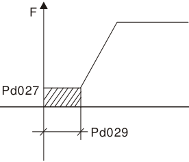

This parameter is set for DC Braking at start and the lasting time of DC Braking current to the motor. If it is set to zero it means DC braking is invalid. DC braking at start is normally used in the application, in which the load is movable when the T machine is at stop, such as windmill. Because of the load existing before the inverter drives, the motor is often in coasting with an uncertain rotation direction.

So the DC braking can be executed before starting the motor to prevent the inverter from tripping. This setting is valid only when PD025 is set to 0. For the related parameters refer to PD025, PD031 and PD027.

#### PD030 DC Braking Time at stop

**Set Range：0.0—25.0 Unit：0.1S Factory Setting：0.0**

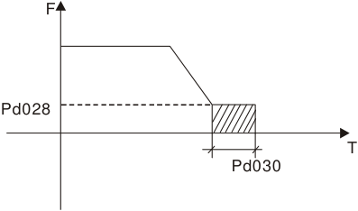

Note: When this parameter is set to any non-zero value it starts DC brake at stop and sends the DC braking time to the motor. DC braking at stop is often used for a high-level stop or positioning control. When this parameter is set to zero it closes DC braking at stop. This setting is valid when PD026 is set to 0. For the related parameters refer to PD026, PD028 and

PD031.

#### PD031 DC Braking Voltage Level

*Set Range: 0.0—20.0% · Unit: 0.1% · Factory Setting: 2.0*

This parameter is set for the DC braking voltage to the motor at start and stop. It can be adjusted for different braking voltage. When adjusting the parameter it must be increased slowly from lower value to high value until the sufficient braking torque is achieved.

The voltage at maximum frequency is 100% voltage.

#### PD032 Frequency Track Time

*Set Range: 0.1—20.0S · Unit: 0.1S · Factory Setting: 2.0*

This parameter is set as frequency track time when the inverter is started by frequency track after

an external abnormality or temporary power breakdown. For starting or stopping of some large inertia load, if restarting a machine after its complete stop, it will waste much time because of its large inertia of load. But if the frequency track is started, it is not necessary to wait for the machine to come to a full stop for restart. The inverter will trace the frequency from high to low with the set frequency. After searching it will continue to accelerate to reach the set frequency.

#### PD033 Current Level for Frequency Track

*Set Range: 0—200% · Unit: 1% · Factory Setting: 150*

When the inverter is tracing the frequency this set value is taken as the level for output current. When the output current is higher than this level the inverter will decrease the frequency to restore the current below the level and then it will execute the frequency track again.

#### PD035 Up/down Frequency Step Length: 0.01~2.5 Factory Setting： 0.01

This parameter can be set in combination with PD078 for Up/Down of external control and the speed of increase and decrease.

In case of PD078=1 the step length of Up/Down=the set value of PD035, i.e., the range can be set to 0.01~25HZ.

In case of PD078=0 the step length of Up/Down=the set value of PD035 ×10, i.e., the range can be set to 0.1~25.0HZ.

#### PD041 Carrier Frequency （Note: 0—15 corresponds to 0—20K Hz）

*Set Range: 0—15 · Unit: 1 · Factory Setting: 5*

The carrier frequency has some relation with the electromagnetic noise of the motor, and meanwhile the level of the carrier frequency has certain relation with the heating capacity of the inverter and the interference to the environment. See the following table：

| Carrier Frequency | Electromagnetic Noise | Heating Capacity | Interference to the Environment |
|---|---|---|---|
| Low | High | Small | Little |
| High | Low | Large | Great |

**Carrier Frequency Corresponding Table**

| Set Value | 0 | 1 | 2 | 3 | 4 | 5 | 6 | 7 | 8 | 9 | 10 | 11 | 12 | 13 | 14 | 15 |
|---|---|---|---|---|---|---|---|---|---|---|---|---|---|---|---|---|
| Carrier Frequency (kHz) | 0.7 | 1 | 1.5 | 2 | 3 | 4 | 5 | 7 | 8 | 9 | 10 | 11 | 13 | 15 | 17 | 20 |

As shown in the table above, the higher the carrier is, the lower the electromagnetic noise of the motor will be, but the stronger its interference to other systems will be and the greater the heating capacity of the inverter will have. Under higher ambient temperature and heavier load of the motor the carrier frequency should be decreased properly to improve the heat characteristics of the inverter.

The factory setting of carrier frequency is depending on the model. For specific data refer to the table in the description of PD007.

|PD042  Jogging Frequency||**|
|---|---|---|
|Set Range：0.00—400.00       Unit：0.01|Factory|Setting：5.00|

The parameter set can realize the jogging function when the inverter is tested. The jogging operation can be only achieved through the external terminals, which can be set by multi-input terminals. Jogging frequency is limited by the frequency upper/lower limits. While the jogging function is implemented, other running commands are invalid. The ramp-up time of jogging frequency is set by Ramp-up Time 4. When the jog button is released the inverter will stop output immediately. In case of jogging function please set the corresponding multi-input terminals to 07 or 08.

This function is only valid at stop. It is invalid at running. For the related parameters refer to PD044-PD049.

#### PD043 S-Curve Time

*Set Range: 0—6500S · Unit: 1 · Factory Setting: 1*

This parameter can be set for no impact slow start or slow stop of the inverter when starting or stopping. When starting S-curve the inverter will make accelerating or decelerating curve of different speed rates according to Ramp Time.

When PD043 is set as 0, S-curve is invalid, i.e. it will accelerate or decelerate in linear. Without consideration of stall the actual accel/decal time = (PD008+PD043)/2. The parameter is only valid when PD008 is less than PD043.

|PD044|Multi-input 1（FOR function）|Factory Setting：02|
|---|---|---|
|PD045|Multi-input 2（REV function）|Factory Setting：03|
|PD046|Multi-input 3（RST function）|Factory Setting：10|
|PD047|Multi-input 4（SPH function）|Factory Setting：17|
|PD048|Multi-input 5（SPM function）|Factory Setting：18|
|PD049|Multi-input 6（SPL function）|Factory Setting：19|
||Set Range：00—32      Unit：|No||

- 00: Invalid. The terminal is set for empty to prevent false actions. 01: RUN Running. It can be combined with other terminals to compose multiple control modes.
- 02: FOR Forward Rotation 03: REV Reverse Rotation 04: STOP Stopping 05: FOR/REV Switching of FOR/REV rotation 06: JOG Jogging 07: Jog FOR Rotation 08: Jog REV Rotation 09: Emergent Stop： Emergent stop. It can receive external emergent stop command or other fault signals
- 10: RST Reset. This terminal can be used for reset after a fault is removed. 11: Reserved 12: Over-heat of heat sink or motor:  This contact can be used to detect over-heat of the heat sink or motor to protect the motor and inverter.

- 13: External Control Timer 1 Start:  When the contact is closed, the timer will start and begin to count time. When the timer reaches the set point the corresponding multi-inputs will act.
- 14: External Control Timer 2 Start
- 15~16：Reserved
- 17:  High speed High, middle and low speed can compose three kinds of operation mode
- 18: Middle speed with different frequencies. In the three terminals the high-end signal has 19: Low speed priority. Low, Middle and High Speed are determined respectively by Frequency 2, 3, 4.
- 20: Multi-speed 1 7-speed setting can be composed through Multi-speed 1, 2, 3.
- 21:  Multi-speed 2
- 22: Multi-speed 3
- 23: Ramp Time 1:  This terminal can be used to select the ramp time of the inverter.
- 24: Ramp Time 2:  4 kinds of ramp time are available for choice.
- 25: UP Function When the switch of this terminal acts the frequency setting of the inverter will be increased or decreased by one unit. When the switch of the terminal is hold the frequency will increase or decrease rapidly to a point and then increase or decrease
- 26: Down Function at even speed. When the power is up again after the power breakdown the changed frequency will not be memorized.
- 27: Counter Pulse When this terminal is set for the counter it can receive the pulse signal of ≤250HZ and counts.
- 28:  Counter Reset When this contact acts it will clear the present counting values displayed, restore C00 and restart counting.
- ﹡29：Drawing Start When this contact is triggered the drawing action starts.
- ﹡31：AutoPLC Reset Suspend   This contact can be used to achieve the function of AutoPLC clear suspend.
- ﹡32:  PID Valid When this contact is closed, PID function starts. PID Function start is only valid during operation.

**Note:**

- ① **The above functions with the mark of** ﹡ **are dedicated to the inverter of A series, which may be not available for P or J series.**
- ② **The functions of above 17 – 22 and 31 are not available for P series, and the function of above 32 is not available for J series.**

**Explanation:**

**1. Three multi-function terminals can be used for the connection method of three-wire system for the realization of switching of FOR/REV rotation, which is extensively applied in the cases of FOR/REV switching of photoelectric switches.**


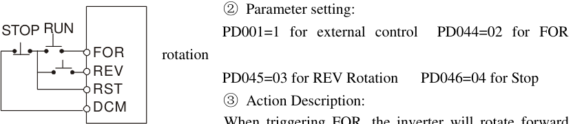

When triggering FOR, the inverter will rotate forward

(start);

When triggering REV, the inverter will rotate reverse;

When pressing STOP, the inverter will stop.

**2. RUN, DCM, F/R can be used for Start, Stop and switching of FOR/REV:**

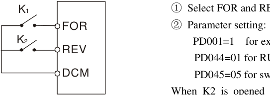

① Select FOR and REV  Select FOR and REV

PD001=1  for external control PD044=01 for RUN function PD045=05 for switching of F/R

When K2 is opened it rotates forward, while K2 is closed it rotates reverse.

**3. Description of Ramp Time 1 and 2:**

- 1) This function is only valid when PD080 is set to 0, 1 and 2. Under the disturbance and internal control multi-speed it is invalid.
- 2) Any two multi-inputs can be combined for 4 kinds of ramp time for selection.
- 3) The related multi-inputs are set for Ramp Time 1, 2. Take the terminals of SPH and SPM as example, when SPH PD047 is set to 23 and SPM PD048 is set to 24, SPH and SPM are now Ramp Time 1, 2.

|SPH|SPM|Result|
|---|---|---|
|OFF|OFF|RampTime 1|
|ON|OFF|RampTime 2|
|OFF|ON|RampTime 3|
|ON|ON|RampTime 4|

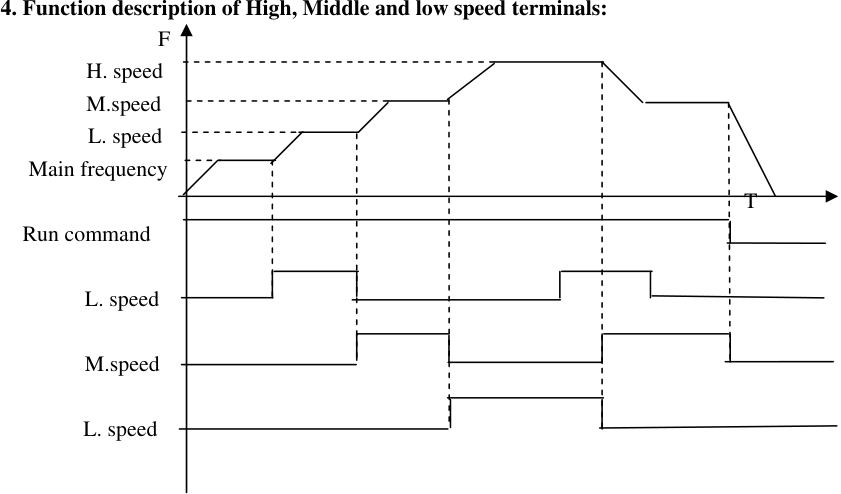

|RUN|SPL|SPM|SPH|Result|
|---|---|---|---|---|
|ON|OFF|OFF|OFF|Main speed, the frequency runs at<br>the set value of PD003.|
|ON|ON|OFF|OFF|Low speed, the frequency runs at<br>the set value of PD086.|
|ON|ON/OFF|ON|OFF|Middle speed, the frequency runs<br>at the set value of PD087.|
|ON|ON/OFF|ON/OFF|ON|High speed, the frequency runs at<br>the set value of PD088.|

Note:

- （1）This function is only valid when PD080 is set to 1, i.e. for 4-Speed of external control.
- （2）Low, middle and high speed frequency are determined by Frequency 2,3, 4.
- （3）Ramp time is determined by Ramp Select terminal.
- （4）When all high, middle and low speeds have signal inputs it will give priority in the sequence of high, middle and low speed.

**5. Description of UP and DOWN Function:**

Max.operating Frequency Set frequency

F.Lower Limit

Up Command Down Command

|UP|DOWN|Result|
|---|---|---|
|ON|OFF|Frequencyincrease|
|OFF|ON|Frequencydecrease|
|ON|ON|Not increase or decrease|

**Note:**

- （1）The function of UP and DOWN is only valid when the operator is selected for the source of the operating frequency, i.e. PD002=0.
- （2）When the UP terminal is closed the frequency of the inverter will increase.
- （3）When the DOWN terminal is closed the frequency of the inverter will decrease.
- （4）When both UP and DOWN terminals are closed at the same time the frequency will neither increase nor decrease. It is regarded as invalid.
- （5）When the frequency reaches the max operating frequency it will stop increasing.
- （6）When the frequency reaches the min frequency or its lower limit, it will stop decreasing.
- （7）After a power breakdown the set value of PD003 will be memorized instead of the frequency.
- （8）When using the function of UP and DOWN, the keys of △▽ of the panel are valid. After changing the values it needs to press SET (ENTER) key for confirmation and then the inverter can implement the action. Meanwhile the value will write to PD003, which will be memorized after a power breakdown.
- （9）When keeping pressing UP or DOWN，the frequency will increase or decrease rapidly to a point and then increase or decrease at even speed.
- （10）The value changed by UP or DOWN can be set through PD077 for confirmation of whether it should be memorized or not memorized. For details refer to PD077.

**6. Function Description of Multi-speed 1, 2 and 3:**

They are only valid when PD080 is set to 2.  For details refer to PD080.

**7. Function Description of Counter ：**

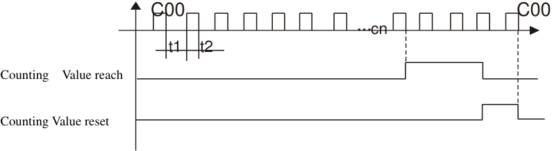

Note:

- （1）The signal width triggered should not be lower than 2 msec（t1、t2≥2msec）.
- （2）When the counting value is reached the corresponding multi-output contact will act.
- （3）This counter can only count again after reset.
- （4）When reaching to 65535 the counter will not count again.

**8. Description of AutoPLC Clear Suspend:**

For details refer to 10. Example Application of AutoPLC Suspend in Appendix 1 and the description of related parameters in PD117.

|﹡PD050|Multi-Output 1（DRV function）<br>|Factory Setting：01**|
|---|---|---|
|﹡PD051|Multi-Output 2（UPF function）<br>|Factory Setting：05|
|﹡PD052|Multi-Output 3（FA, FB, FC function）|Factory Setting：02|
|﹡PD053|Multi-Output 4（KA, KB function）|Factory Setting：00|
||Set Range：00—32      Unit：1|||

- 00: Invalid:  The terminal is set for no function to prevent false actions.
- 01: In Run:  The contact will act when the inverter has output or receives the running command.
- 02: Fault Indication: The contact will act when the inverter detects abnormal conditions.
- 03: Zero Speed: The contact will act when the output frequency of the inverter is less than its starting frequency.
- 04: DC Braking indication: The contact will act when the inverter is in DC braking.
- 05: Set Frequency reach: The contact will act when the output frequency of the inverter reaches the set frequency.
- 06: Uniform Frequency 1 Reach: The contact will act when the output frequency of the inverter reaches the designated frequency (PD060).
- 07: 。Uniform Frequency 2 reach: The contact will act when the output frequency of the inverter reaches the designated frequency (PD061).
- 08: In Accel:  The contact will act when the inverter is in ramp-up.
- 09: In Decel:  The contact will act when the inverter is in ramp-down.
- 10: Inverter Over-load Alarm:  The contact will act when the inverter detects over-load.
- 11: Motor Overload Alarm:  The contact will act when the inverter detects over-load of the motor.
- 12: In Over-torque Detect:  The contact will act when the inverter detects over-torque.
- 13: Low Voltage Alarm:  The contact will act when the inverter detects low voltage.
- ﹡14： Single Step End:  The contact will act and generate one pulse when the inverter finishes a single step in implementation of program operation.
- ﹡15： Process End:  The contact will act and generate one pulse when the inverter finishes all

   - Edited by CNCDIY CNC Routing Machine System

the steps (i.e. after one cycle) in implementation of program operation.

- 16: Set Counter Reach:  The contact will act when the inverter implements the external counter and the counting value is equal to the set value (PD065).
- 17: Middle Counter Reach:  The contact will act when the inverter implements the external counter and the counting value is greater than or equal to the set value (PD066).
- 18: External Control Timer 1 reach: The contact will act when the timer reaches the set value.
- 19: External Control Timer 2 reach:
- 20: 4∽20mA disconnected:  When AI input signal is opened the contact will act.
- ﹡25：Auxiliary Pump 1:  This contact controls the starting and stopping of auxiliary pumps. For details refer to Operation of Multi-pumps.
- ﹡26：Auxiliary Pump 2
- ﹡27：Drawing reach:  The contact will act when the drawing action is finished. The contact will automatically reset when the inverter stops.
- ﹡28： PID Lower Limit Alarm:  This contact will act when the PID feedback is smaller than the lower limit (the set value of PD162).
- ﹡29：PID Upper Limit Alarm:  This contact will act when the PID feedback is greater than the upper limit (the set value of PD161).
- 30: Fan act:  When the temperature of the inverter is increased or it is in running, this contact will act.
- 31: Electromagnetic Relay Act:  When the contact pulls in, the corresponding multi-function terminal will act.
- 32: Braking Resistor Act:  When the inverter is in running and the DC voltage reaches the braking voltage the contact will act.

**Note:**

- ① **The above functions with the mark of** ﹡ **are dedicated to the inverter of A series, which may be not available for P or J series.**
- ② **The functions of above 14, 15 and 27 are not available for P series, and the functions of above 25, 26, 28 and 29 are not available for J series.**

#### PD054 Multi-Output AM
*Set Range: 0—7 · Unit: 1 · Factory Setting: 0*

Functions: Output terminal of digital frequency, generating pulse or 0 — 10V analog. In combination with PD055 it can be connected with a corresponding instrument with the measuring range below 10 to be used for external monitoring.

- 0: 0～10V analog output, corresponding to output frequency. 0～10V corresponds to 0～ Maximum operating frequency
- 1: 0～10V analog output, corresponding to output current. 0～10V corresponds to 0～two times of the rated current of the inverter.
- 2: Analog output, corresponding to DC bus voltage. 0～10V corresponds to 0～1000V.
- 3: Analog output, corresponding to AC output voltage. 0～10V corresponds to 0～510V/255V. （Note: The machine type of three phase, 380V corresponds to 510V and the machine type of single phase, 220V corresponds to 255V）
- 4: Pulse Output, corresponding to operating frequency: 1 Pulse/Hz,（50% of capacity ratio）
- 5: Pulse Output, corresponding to operating frequency: 2 Pulse /Hz,（50% of capacity ratio）
- 6: Pulse Output, corresponding to operating frequency: 3 Pulse /Hz,（50% of capacity ratio）

   - Edited by CNCDIY CNC Routing Machine System

- 7: Pulse Output, corresponding to operating frequency: 6 Pulse /Hz,（50% of capacity ratio）

#### PD055 AM Analog Output Gain

*Set Range: 0.0—100.0% · Unit: 0.1% · Factory Setting: 100.0*

This parameter can be used to adjust the output voltage value of Multi-output 6 to adapt to frequency meters with different measuring range and also used to correct a frequency meter. For example, for an externally connected frequency meter with the measuring range of 0~5V, a multi-function terminal can be used to display its operating frequency. Then it can be corrected with this parameter. It can be achieved by setting PD055=50 .

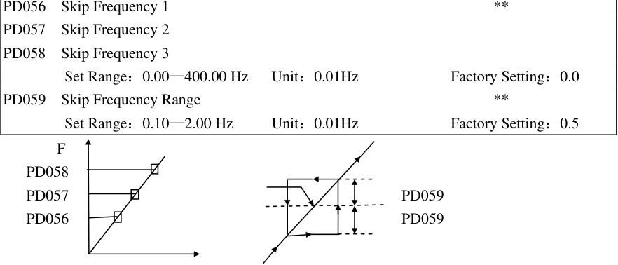

These three frequency skipping points are set for avoiding a mechanical resonance point. In case of PD059=0, all skip frequencies are invalid. The actual skip frequency range is two times that of PD059, as shown in the above diagram.

|PD060|Uniform Frequency 1||**|
|---|---|---|---|
|PD061|Uniform Frequency 2|||
||Set Range：0.00—400.00 Hz|Unit：0.01 Hz|Factory Setting：0.00|
|PD062|Uniform Frequency Range||**|
||Set Range：0.00—10.00 Hz|Unit：0.01 Hz|FactorySetting：0.50|

When the output frequency is more than the uniform frequency the corresponding multi-outputs will act. The uniform frequency range acts as a hysteresis loop.

When the inverter is in the operation of multi-pumps, PD060 (Uniform Frequency 1) is used as high speed frequency and PD061 is set as low speed operating frequency. The definitions of the corresponding multi-function contacts are changed.

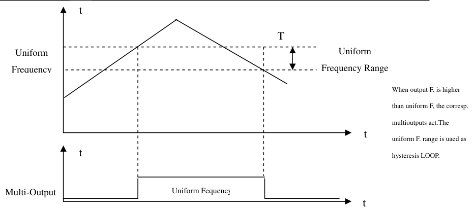

#### PD063 Timer 1 Time

*Set Range: 0～10.00 · Unit: 1 · Factory Setting: 0.01 PD064  Timer 2 Time Set Range: 0～100 · Unit: 1 · Factory Setting: 0*

Timer 1 is a timer of 0.1s ~ 10.0s and Timer 2 is a timer of 1s ~ 100s. When the timer start at multi-inputs is closed (on) the timer starts to count time. When it reaches the set time the corresponding multi-output contact will act. When the timer start is opened (off) the timer time at the multi-output will be reset.

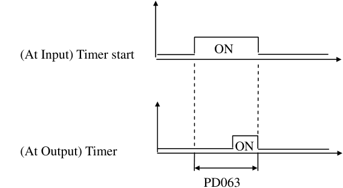

For example, set PD063=5.0s. When the external control terminal (Multi-Input) is valid the output terminal will be valid after five (5.0) seconds, the signal of which can be used to control other corresponding signals.

|PD065   Counting Value||**||
|---|---|---|---|
|Set Range：0—65500|Unit：1|Factory|Setting：0|

An external terminal of multi-function can be used as a trigger for the counter. When the counter reaches the set value of PD065 the corresponding multi-output contact will act. After the counter is cleared and reset it will start counting again. A proximity switch or optoelectronic switch can be used for the triggering signals.

#### PD066 Intermediate Counter

*Set Range: 0-65500 · Unit: 1 · Factory Setting: 0*

Refer to PD065.

|PD070   Analog Input|||
|---|---|---|
|Set Range：0—|10<br>Unit：1|FactorySetting：0|
|0：0~10V|1：0~5V|2：0~20mA|
|3：4~20mA|4：0-10V与4-20mA stacked|5：XIA|
|6：（VI+XIA）/2|7：（3VA+XIA）/4|8：（XIA+XIB）/2|
|9：Max (XIA, XIB)|10:Min (XIA,XIB)||

This parameter can be set for different analog input signals.

When PD070=4, the output frequency =1/2（U/Umax + I/Imax）× 50Hz

Among which: U：Analog Voltage; Umax: Maximum Analog Voltage;

I:  Analog Current; Imax:  Maximum Analog Current.

For example, When +10V and 20mA are respectively entered for the analog input, the output frequency of the inverter is 50Hz.

#### PD071 Analog Filtering Constant

*Set Range: 0-50 · Unit: 1 · Factory Setting: 20*

The setting of this parameter is related to the analog responding speed. The higher the value of PD071 is set, the lower the analog responding speed will be.

|PD073   Lower Analog Frequency|||
|---|---|---|
|Set Range：0.00—400.00 Hz|Unit：0.01 Hz|Factory Setting：0.00|
|PD075   Bias Direction at Lower Freque|ncy||
|Set Range：0—1<br>|Unit：1|FactorySetting：0|

- 0: Positive direction
- 1: Negative direction

Bias direction means the instruction of FOR/REV rotation command. Positive bias indicates forward rotation while negative bias indicates reverse rotation. For details refer to the diagram in PD076.

|PD072   Higher Analog Frequency||
|---|---|
|Set Range：0.00—400.00 Hz|Unit：0.01Hz        Factory Setting：50.00|
|PD074   Bias Direction at Higher Frequen|cy|
|Set Range：0—1|Unit：1            FactorySetting：0|

- 0: Positive direction
- 1: Negative direction

Bias direction means the instruction of FOR/REV rotation command. Positive bias indicates forward rotation while negative bias indicates reverse rotation. For details refer to the diagram in PD076.

#### PD076 Analog Negative Bias Reverse

*Set Range: 0—1 · Unit: 1 · Factory Setting: 0*

- 0: Negative bias Rev is not allowable.
- 1: Negative bias Rev is allowable.

The parameter group is set for the measuring range and zero point of the external analog terminals and can be combined for any kind of curve to control the operation of the motor.

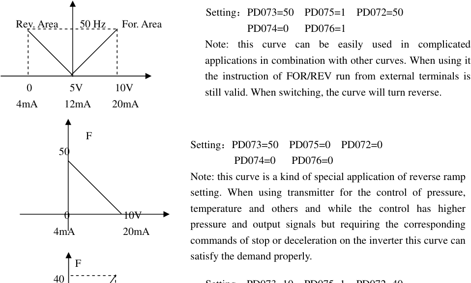

Setting：PD073=10  PD075=1  PD072=40

PD074=0   PD076=1

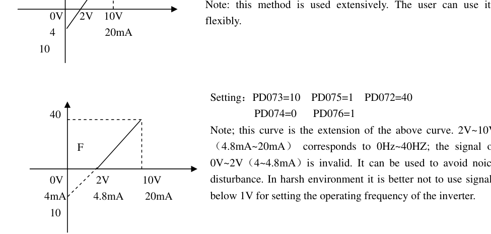

Note; this curve is the extension of the above curve. 2V~10V （4.8mA~20mA） corresponds to 0Hz~40HZ; the signal of4.8mA~20mA） corresponds to 0Hz~40HZ; the signal of） corresponds to 0Hz~40HZ; the signal of corresponds to 0Hz~40HZ; the signal of 0V~2V（4~4.8mA）is invalid. It can be used to avoid noice（4~4.8mA）is invalid. It can be used to avoid noice4~4.8mA）is invalid. It can be used to avoid noice）is invalid. It can be used to avoid noiceis invalid. It can be used to avoid noice 0V      2V      10V                    disturbance. In harsh environment it is better not to use signalsdisturbance. In harsh environment it is better not to use signals 4mA     4.8mA    20mA                    below 1V for setting the operating frequency of the inverter.  below 1V for setting the operating frequency of the inverter.

#### PD077 UP/DOWN Function

*Set Range: 0-1 · Unit: 1 · Factory Setting: 0*

- 0: Not memorized 1：Memorized

This parameter can be set for the selection of whether the values changed by the UP or DOWN shall be memorized or not after stop. The changed values whether to be memorized or not means

when they are changed by UP or DOWN during operation and the inverter is restarted after stop these changed values shall be memorized or not after restart. When PD077 is set to 0, the changed value will not be memorized and when it is set to 1, the changed values will be memorized. The set values of PD003 will be memorized after restart.

For the related parameters refer to PD044-PD049.

#### PD078 UP/DOWN Speed

*Set Range: 0-1 · Unit: 1 · Factory Setting: 0*

- 0: 0.01Hz. Minimum UP/DOWN speed is 0.01Hz.
- 1: 0.1Hz. Minimum UP/DOWN speed is 0.1Hz.

Through the changes of this set value the UP/DOWN speed unit can be adjusted to meet the needs of different customers.

|PD080   PLC Operation|
|---|

*Set Range: 0—5 · Unit: 1 · Factory Setting: 0*

- **This function is not available for the inverter of P series. Default is normal operation.**
- 0: Normal operation, i.e. the inverter is running in the normal control mode.
- 1: External control 4-Speeds (Refer to the function description and diagram of three terminals of high, middle and low speed in C050～C055)
- 2: External control multi-speeds

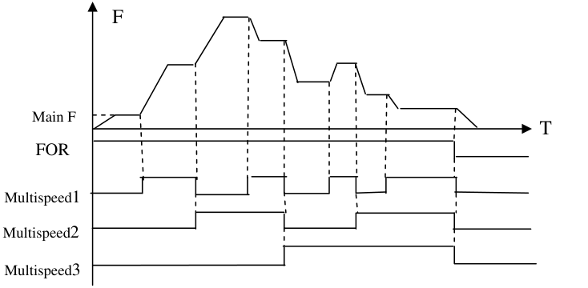

|Mul|ti-function Termi|nals|Results|
|---|---|---|---|
|Multi-speed 1|Multi-speed 2|Multi-speed 3||
|OFF|OFF|OFF|Main frequency and frequencies are determined<br>byPD003 orpotentiometer.|
|ON|OFF|OFF|Multi-speed 1 and frequency are determined by<br>PD086.|
|OFF|ON|OFF|Multi-speed 2 and frequency are determined by<br>PD087.|
|ON|ON|OFF|Multi-speed 3 and frequency are determined by<br>PD088.|

|OFF|OFF|ON|Multi-speed 4 and frequency are determined by<br>PD089.|
|---|---|---|---|
|ON|OFF|ON|Multi-speed 5 and frequency are determined by<br>PD090.|
|OFF|ON|ON|Multi-speed 6 and frequency are determined by<br>PD091.|
|ON|ON|ON|Multi-speed 7 and frequency are determined by<br>PD092.|

Note:

- ① It is only valid to realize the external control 8-Speeds operation when Multi-inputs are set for Multi-speed 1, 2, 3 and PD080 is set to 2.
- ② Multi-speed 1, 2, 3 can be used to make up 7-Speeds and 8-Speeds adding the main frequency .
- ③ The frequencies of Speed Step 1 ~ Step 7 are determined by PD086~PD092.
- ④ Each ramp time is determined by the external multi-function terminal.
- ⑤ The directions of each program operation are determined by the external multi-function terminals.
- ⑥ The main frequency can be set in two ways. One method is to set it through PD003 and another is to set it through the potentiometer. When PD002 is set to 1 the frequency of Main Frequency is set by the potentiometer. For the related parameters refer to PD003, PD002 and PD086~PD092.
- 3: Disturbance (Traverse function)

This is a special parameter in the chemical fiber and printing and dying industries to realize the traverse function. Except the commands of stop, external faults and emergency stop all other commands are not accepted at running.

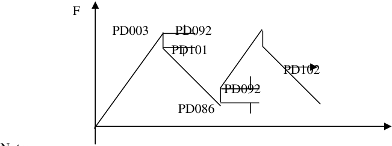

Note:

- ① The frequency at each inflection point is determined by PD003 and PD086.
- ② Skip Frequency is determined by PD092.
- ③ Running Time is determined by Timer PD101 and PD102.
- ④ The related parameters: PD003, PD086~PD102.

- 4: Internal control Multi-speeds

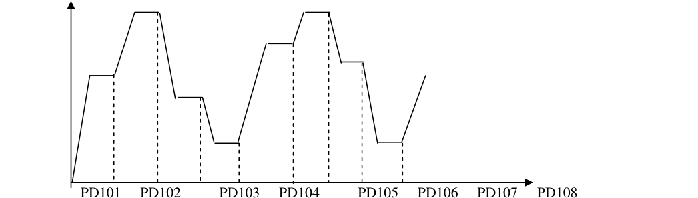

T

Note:

- ① Main speed and 7-speeds composes 8-speeds.
- ② The ramp time of each speed step is set by PLC Ramp Time CD079. Refer to the detail descriptions of CD079.
- ③ Running Time is set by Timer PD101~PD108. For the control steps not to be used the timer can be set to 0.
- ④ Running direction of each speed step is determined by CD078.
- ⑤ In the internal control multi-speed operation the running time and direction are determined by the setting of internal parameters. Any switching of external time and FOR/REV rotation is invalid.

**5：Drawing**

This is a special parameter for the constant speed of unwinding and rewinding. By using this function the linear speed constant in certain accuracy can be realized.

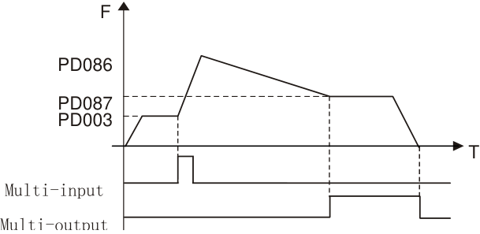

Note:

- ① Through triggering of the external multi-function terminal the drawing action begins.
- ② In implementation of the drawing action the actual running time is T=PD101×10.
- ③ when the drawing action is finished the inverter will run at the constant seed of PD087 and the corresponding multi-output contact will act at the same time. Until receiving the STOP command the inverter will stop running and the multi-output contact will reset.

#### PD081 Auto PLC

*Set Range: 0—3 · Unit: 1 · Factory Setting: 0*

- **This function is not available for the inverter of P series.**
- 0: Stop after the program runs one cycle.
- 1: Cycling running.
- 2: Stop after it runs one cycle automatically（STOP for intervention）.
- 3: Auto running and cycling （STOP for intervention）

This parameter setting is only valid when PD080 is set to 4. For relevant parameters refer to PD003, PD080 and CD078~PD108.

**Explanation:**

**1. Stop after the program runs one cycle.**

When the command of auto program operation is given, the inverter will run with each set value of internal parameters. It will run for one cycle and then stop automatically. The inverter will not restart and run until it receives another command of operation.

**2. Cycling run.**

When the command of operation is given, the inverter will run in sequence with the frequency of every speed step and running time set by each of the internal parameters and will recycle. During the cycling run, except the commands of stop, external faults and emergency stop, all other commands will not be accepted.

**3. Stop after it runs one cycle automatically** （ **STOP for intervention** ）

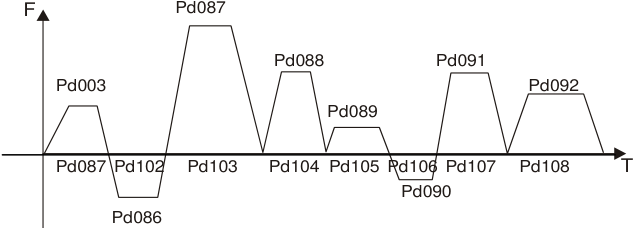

Note:

① When the command of auto program operation is given the inverter will run with each parameters. But it will stop first and then restart at changing of each step and will stop automatically after running for one cycle. The inverter will not restart and run until it receives another command of operation.

- ② The frequencies of each speed step are set by PD003 and PD086～PD092.
- ③ The running times of each speed step are set by PD101～PD108.
- ④ The running direction is set by P082

#### PD082 PLC Running Direction

ge：0—255               Unit：1            Factory Setting：0

This parameter is only valid when PD080 is set to 4. This parameter setting determine the running direction of each frequency of PD086~PD092 and PD003 in the program operation. The setting method is as follows:

The rotation direction is set first in the binary 8 bits mode, and then converted to a decimal value for the setting of this parameter. For instance:

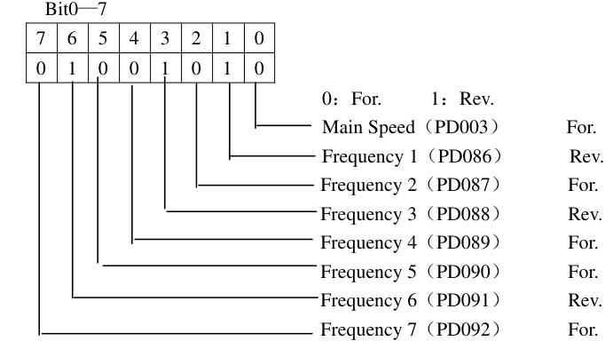

The parameter value 01001010 is converted to a decimal value： 1×2<sup>6</sup> +1×2<sup>3</sup> +1×2<sup>1</sup> =64+8+2=74

Then PD082=74

#### PD084 PLC Ramp Time

*Set Range: 0~65535 · Unit: 1S · Factory Setting: 0*

This parameter is only valid when PD080 is set to 4.

This parameter is set to determine the ramp time values for Step 1~4 of the internal control multi-speed. The setting method is as follows:

**① Determine each Ramp Time in the binary 2 bit mode**

|Bit1|Bit0|RampTime|
|---|---|---|
|0|0|RampTime 1 PD014,PD015|
|0|1|RampTime 2 PD016,PD017|
|1|0|RampTime 3 PD018,PD019|
|1|1|RampTime 4 PD020,PD021|

② Determine the Ramp time of each speed step in the binary 16 bit mode

|Step|8|Step|7|Step|6|Step|5|Step|4|Step|3|Step2|Step1|
|---|---|---|---|---|---|---|---|---|---|---|---|---|---|
|t8||t7||t6||t5||t4||t3||t2|t1|
|0|0|0|0|0|0|0|0|0|1|1|0|0<br>0|1<br>1|

t1 Select Ramp Time 4 t2 Select Ramp Time 1 t3 Select Ramp Time 3           The setting value: t4 Select Ramp Time 2           1×2<sup>0</sup> +1×2<sup>1</sup> +1×2<sup>5</sup> +1×2<sup>6</sup> =99 t5 Select Ramp Time 1           So PD084 is set to 99 t6 Select Ramp Time 1           Attach：2<sup>0</sup> =1   2<sup>1</sup> =2   2<sup>2</sup> =4   2<sup>3</sup> =8 t7 Select Ramp Time 1                  2<sup>4</sup> =16  2<sup>5</sup> =32  2<sup>6</sup> =64  2<sup>7</sup> =128 t8 Select Ramp Time 1

|PD086     Frequency 2                             Factory Setting     15**|
|---|
|PD087     Frequency 3                             Factory Setting     20|
|PD088     Frequency 4                             Factory Setting     25|
|PD089     Frequency 5                             Factory Setting     30|
|PD090     Frequency 6                             Factory Setting     35|
|PD091     Frequency 7                             Factory Setting     40|
|PD092     Frequency 8                             Factory Setting     0.5|
|Set Range：0.00—400.00 Hz    Unit：0.01 Hz|

This parameter is set in combination of the multi-inputls to select 4-speeds of external control, multi-speeds of external control or multi-speeds of internal control. For the relevant parameters refer to the description of PD080 and PD101~PD108.

|PD101     Timer 1|Factory Setting     10.0**|
|---|---|
|PD102     Timer 2|Factory Setting     10.0|
|PD103     Timer 3|Factory Setting     0.0|
|PD104     Timer 4|Factory Setting     0.0|
|PD105     Timer 5|Factory Setting     0.0|
|PD106     Timer 6|Factory Setting     0.0|
|PD107     Timer 7|Factory Setting     0.0|
|PD108     Timer 8|Factory Setting     0.0|
|Set Range：0.0—6500.0S|Unit：0.1S|

This parameter is set for the internal control multi-speeds and the running time of drawing function. For the relevant parameter refer to PD080 and PD086~PD102.

|PD117     AutoPLC Memory|Function|
|---|---|
|Set Range：0—1|FactorySetting：0|

- 0: Not memorized
- 1: Memorized

This parameter is set to determine whether the inverter is to realize the suspending function in AutoPLC mode. In case of PD117=1 it can memorize the status in which the inverter is running and will memorize it at stop or fail. It will continue to run when returning to normal. In case of PD117=0 it will not memorize. For specific applications refer to Example Application 10 in

Appendix 1.

|PD118    Over-voltage Stall Prevention|
|---|
|Set Range：0—1          Unit：1                FactorySetting：1|

- 0: Over-voltage stall prevention invalid
- 1: Over-voltage stall prevention valid.

When the inverter is in deceleration, due to the effect of load inertia, the motor will produce a return energy to the inverter and cause the DC voltage of the inverter to increase. So when the function of over-voltage stall prevention is started, if the DC voltage of the inverter becomes too high, the inverter will stop decelerating till the voltage at DC decreases below the set value, then the inverter will go on to decelerate and the ramp-down time will be extended automatically.

|PD119|Stall Prevention Level at|Ramp-up|
|---|---|---|
||Set Range：0—200%|Unit：1%               FactorySetting：150||

When the inverter is in ramp-up, due to overload or too short ramp-up time, the output current of the inverter will go up quickly and exceed the set standard level. When this happens, the inverter will stop accelerating. When the current returns under its set value, the inverter will go on to accelerate.

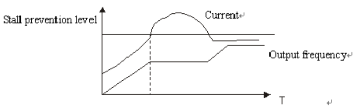

100% current is the rated current of the motor. When this parameter is set to 0, the stall prevention function is invalid.

|PD120|Stall Prevention Level at|Constant Speed|
|---|---|---|
||Set Range：0—200%|Unit：1%                FactorySetting：0||

When the inverter is running at constant speed, due to load fluctuation and other reasons, the current will increase. When the current exceeds its set standard value, the inverter will lower the output frequency. When the output current returns to its normal range, the inverter will accelerate again to its set frequency.

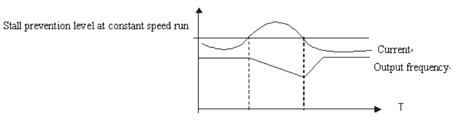

100% current is the Rated Current of the motor. When this parameter is set to 0 the stall prevention function is invalid.

#### PD121 Decel. Time for Stall Prevention at Constant Speed Factory Setting：5.0

When the inverter is used for the loads of kinds of fan and pump PD120 can be set to 120. When the current of the inverter is greater than 120% the output frequency will decrease and the current will also decrease accordingly. After the current returns to normal the frequency will return to normal slowly, so as to achieve the stall prevention function. The decreasing speed of the frequency is determined by PD121. For the Related parameters refer to CD 122.

|PD122|Stall Prevention Level at Deceleration|
|---|---|
||Set Range：0—200%      Unit：1                    FactorySetting：150|||

Refer to PD118.

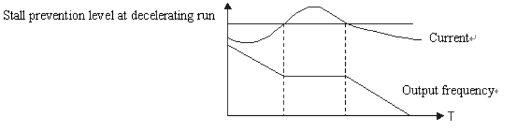

100% current is the rated current of the motor.

#### PD123 Over-torque Detect Mode

*Set Range: 0—3 · Unit: 1 · Factory Setting: 0*

- 0: When reaching the frequency it starts to detect over-torque and when over-torque is detected it continues to run.
- 1: When reaching the frequency it starts to detect over-torque and when over-torque is detected it stop running.
- 2: It detects over-torque during running and when over-torque is detected it continues to run.
- 3: It detects over-torque during running and when over-torque is detected it stop running.

#### PD124 Over-torque Detect Level

*Set Range: 0—200% · Unit: 1% · Factory Setting: 0*

When the output current exceeds the over-torque detection level and also exceeds half of the set time of over-torque detection (factory setting: 1.0s), the over-torque detection will indicate, and the corresponding multi-function alarm contact will act. When it exceeds the set time, the inverter will turn to self-protection. When this parameter is set to 0, the over-torque detection will be invalid

#### PD125 Over-torque Detect Time

*Set Range: 0.1—20.0s · Unit: 0.1s · Factory Setting: 1.0*

When the inverter detects that the output current has exceeded the motor current set value, the inverter begins to calculate the over-torque time. When the over-torque time has exceeded half of the set detect time, the corresponding multi-function output contact will act, and produce the over-torque alarm, while the inverter will keep running. When the over-torque time has exceeded the set detect time (set by PD125), the inverter will turn to self-protection, display the fault information and stop output..

For the related parameters refer to PD124.

#### PD130 Number of Auxiliary Pump (*)

*Set Range: 0—2 · Unit: 1 · Factory Setting: 0*

**This function is not available for the inverter of J series.**

This parameter is set for the number of auxiliary pump. The start or stop of the auxiliary pumps is controlled by using the multi-output contacts and Auxiliary Pump 1 or Auxiliary Pump 2 is controlled through the peripheral control circuit.

#### PD131 Continuous Running Time of Auxiliary Pumps (*)

*Set Range: 1—9000（min） · Unit: 1 · Factory Setting: 60*

- **This function is not available for the inverter of J series.**

In case of two pumps with only one pump in duty, in order to ensure each pump to work evenly, it will be switched to another pump when its running time reaches the set value of PD131.

- *PD132    Interlocking Time of Auxiliary Pump

*Set Range: 1—250S · Unit: 1 · Factory Setting: 5S*

*** This function is not available for the inverter of J series.**

This parameter is set to determine the interlocking time of two auxiliary pumps when switching with each other.

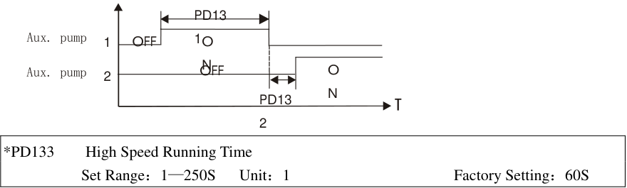

*** This function is not available for the inverter of J series.**

In the application of water supply with constant pressure, when the master pump is running at the frequency of high speed (set by PD060) due to larger water volume and the high speed running time (PD133) is reached, the corresponding multi-function contacts act and the auxiliary pumps start.

#### PD134 Low Speed Running Time (*)

*Set Range: 1—250S · Unit: 1 · Factory Setting: 60S*

*** This function is not available for the inverter of J series.**

In the application of water supply with constant pressure, when the master pump is running at the frequency of low speed (set by PD061) due to smaller water volume and the low speed running time (PD134) is reached, the corresponding multi-function contacts act and the auxiliary pumps stop.

#### PD133 and PD134 must be used in combination of PD060, PD061 and multi-outputs. Their main function is to increase or decrease the number of auxiliary pump.

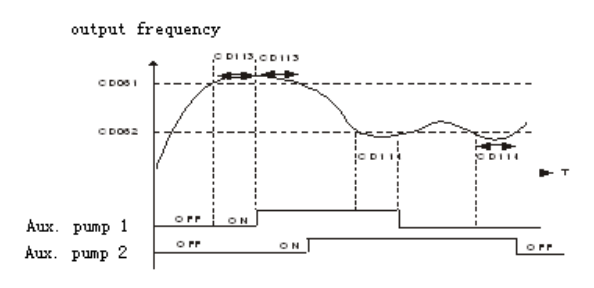

#### PD135 Stopping Voltage Level (*)

*Set Range: 0—150% · Unit: 1 · Factory Setting: 95%*

*** This function is not available for the inverter of J series.**

This parameter is set for the voltage level of the master pump entering into sleep mode. For details refer to the following description.

#### PD136 Lasting Time of Stopping Voltage Level (*)

*Set Range: 1—250S · Unit: 1 · Factory Setting: 30S*

*** This function is not available for the inverter of J series.**

This parameter is set for the lasting time under the stopping voltage level before entering into sleep mode. For details refer to the following description.

#### PD137 Wakeup Voltage Level (*)

*Set Range: 1—150% · Unit: 1 · Factory Setting: 80%*

*** This function is not available for the inverter of J series.**

This parameter is set for the wakeup voltage level from sleep to wakeup.

#### PD138 Sleep Frequency (*)

*Set Range: 0.00—400.0 · Unit: 1 · Factory Setting: 20.00*

*** This function is not available for the inverter of J series.**

This parameter is set for the lowest operating frequency entering into sleep mode.

#### PD139 Lasting Time of Sleep Frequency (*)

*Set Range: 1—250S · Unit: 1 · Factory Setting: 20S*

*** This function is not available for the inverter of J series.**

This parameter is set for the lasting time to run at sleep frequency when entering into sleep mode.

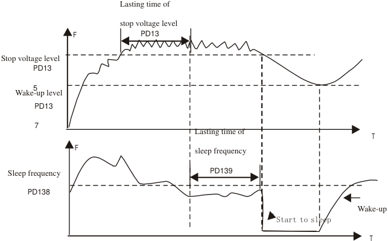

The following is the block diagram of multi pumps operation:

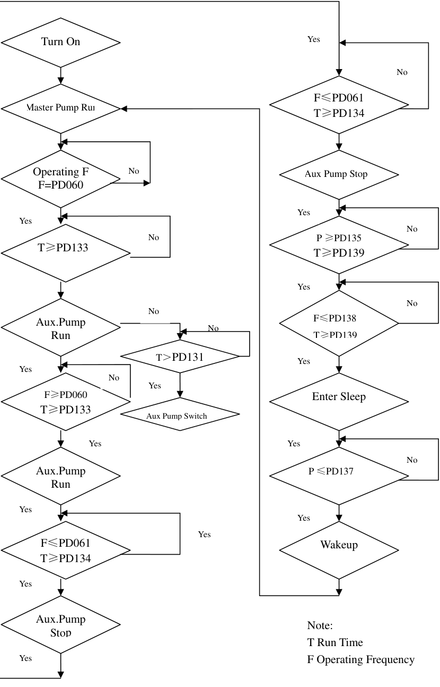

#### PD141 Rated Motor Voltage Unit：0.1V Factory Setting：

It is set according to the rated voltage value of the nameplate of the motor. For the inverters of 230V class the factory setting is 220, while for the inverters of 400 V class the factory setting is 380.

#### PD142 Rated Motor Current Unit：0.1A Factory Setting：

It is set according to the rated value of the nameplate of the motor. This parameter can be used to restrict the output current of the inverter to prevent over-current and protect the motor. If the current of the motor has exceeded this value the inverter of AC motor will turn to self-protection.

#### PD143 Motor Pole Number

*Set Range: 02—10 · Unit: 1 · Factory Setting: 04*

This parameter is set for the number of the motor’s pole according to the nameplate of the motor.

#### PD144 Rated Motor Revolution

*Set Range: 0—9999 · Unit: 1r/min · Factory Setting: 1440*

This is set according to the actual revolution of the motor. The displayed value is the same as this set value. It can be used as a monitoring parameter, which is convenient to the user. This set value corresponds to the revolution at 50Hz.

#### PD145 Auto Torque Compensation

*Set Range: 0.1—10.0 % · Unit: 0.1% · Factory Setting: 2.0% This parameter can be set for the auto output of V extra voltage when the inverter is running to achieve higher torque, which can compensate 100% for the under-torque at lower frequency. The torque compensation should not be too big and it should be set slowly from low to high according to the actual situation. Torgue Compens. Insufficient compensation will result in the*

F

under-torque of the motor at lower frequency. And over compensation will lead to too bigger torque, which will produce a shock to the machine and even result in a trip of the inverter under serious situation.

#### PD146 Motor No-load Current

*Set Range: 0—99 · Unit: 1 · Factory Setting: 40*

The setting of motor no-load current will affect the value of slip compensation. The current is 100% of the rated current of the motor.

#### PD147 Motor Slip Compensation

*Set Range: 0.0—10.0 · Unit: 0.1 · Factory Setting: 0.0*

When the inverter drives the motor the slip becomes bigger due to the increase of load. This

parameter can be set for slip compensation to decrease the slip and make the running speed of the motor closer to the synchronous revolution.

|PD150|Auto Voltage Regulation||
|---|---|---|
||Set Range：0—1|Unit：1            FactorySetting：1||

- 0: Invalid
- 1: Valid

When the input power is not stable and if the voltage is too high the operation of the motor with the power exceeding the rated voltage will cause increase of the temperature of the motor, damage of its insulation and unstable output torque. This auto voltage regulation can automatically stabilize the output voltage within the rated voltage range of the motor under the condition of unstable output power supply

When this function is set to invalid the output voltage will fluctuate.

|PD151|Auto Energy<br>Set Range：0|Saving<br>—10%      Unit：1%              FactorySetting：0|
|---|---|---|

When it is set to zero this function is invalid. When Auto energy saving function is started the

inverter will run at the full voltage during ramp-up or -down. During the operation at constant speed the inverter can automatically calculate the optimum voltage value according to the power of load and supply power to the load to achieve the goal of energy saving.

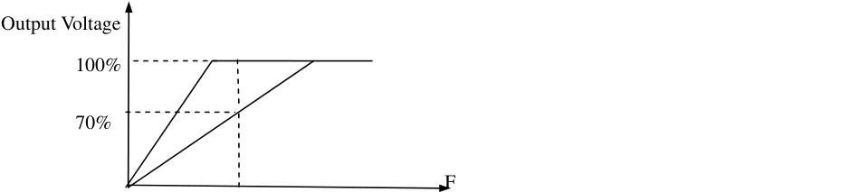

Auto energy saving can reduce the normal output voltage by max 30%. For the load with frequent changes or closing to full load, this function is not suitable.

#### PD152 Fault Restart Time Factory Setting：1.0 s

When the inverter is set for fault restart and if it has a fault trip with the time exceeding the set value of PD152 the inverter will restart. When using this function pay more attention to the safety.

|PD153|Restart after Instantaneous Stop|
|---|---|
||Set Range：0—1              Unit：1            FactorySetting：0|||
|0：Invalid,|i.e. the inverter will not restart after an instantaneous power breakdown.|||

- 1: Start by frequency track. Refer to PD032.

|PD154|Allowable Power-Breakdown Time|
|---|---|
||Set Range：0.1—5.0S    Unit：0.1S               FactorySetting：0.5|||

This parameter is set for the maximum allowable power failure time. If exceeding the set time the

inverter will continue to stop output after power on. To restart the inverter it needs to follow the general starting procedures.

#### PD155 Number of Abnormal Restart

*Set Range: 00—10 · Unit: 1 · Factory Setting: 00*

After the abnormal conditions (such as over-current and over-voltage) happens the inverter will automatically reset and restart. If the starting mode is set to normal mode it will start according to the normal procedures. If it is set to start by frequency track it will start in the frequency track mode. After starting it will restore the set number again if there is no more abnormality happened within 60 seconds.  If there is still any error and it reaches the set number the inverter will stop output. It can only be started after reset. When PD155 is set to zero the inverter will not carry out the functions of automatic reset and restart.

|*PD156   Proportional Constant (P)||**|
|---|---|---|
|Set Range：0.0~1000.0%|Unit：0.1%|FactorySetting：100%|

*** This function is not available for the inverter of J series.**

This proportional constant is set for the error value gain. In case of I=0, D=0, it is only for proportional control.

|*PD157   Integral Time (I)||**|
|---|---|---|
|Set Range：0.1~3600.0s|Unit：0.1s|FactorySetting：5.0s|

*** This function is not available for the inverter of J series.**

The integral time (I) is set for the responding speed for PID. The larger the I value is set the slower the responding speed will be. To the contrary, if the responding speed is quick but the integral time value is set too small, it will cause oscillation.

|*PD158   Differential Time (D)||**|
|---|---|---|
|Set Range：0.01~10.00s|Unit：0.01s|FactorySetting：0|

*** This function is not available for the inverter of J series.**

This differential time (D) is set for the depression operation of PID. The larger the D value is, the more obvious the depression operation will be. When D is set to zero, this function is invalid.

|*PD159   Target Value||**|
|---|---|---|
|Set Range：0~100.0%|Unit：1%|FactorySetting：*|

*** This function is not available for the inverter of J series.**

This target value can be set through external voltage signal or the digital operator.100% target value is corresponding to the analog frequency at +10V.

PID closed-loop control is usually used in the process control with physical quantity not changing fast, such as the controls of pressure and temperature, etc. The feedback signal is usually taken from temperature transmitter, or pressure transmitter, etc. Under PID control, the feedback signal input path is the analog current signal of 4-20mA.

PID closed-loop control is valid when Multi-input PID is started.

PID Control Block Diagram:

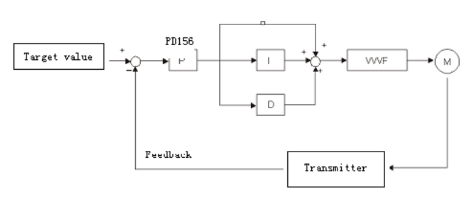

General operating methods of PID control:

- （1）Choose the correct transmitter (with the output specification of standard current signal 4-20mA).
- （2）Set the right target value.
- （3）If the output does not have oscillation, increase the proportional constant (P).
- （4）If the output does not have oscillation, decrease the integral time (Ti).
- （5）If the output do not have oscillation, increase the differential time (Td).
- （6）Concrete applications can be referred to the example application descriptions in Appendix 1.

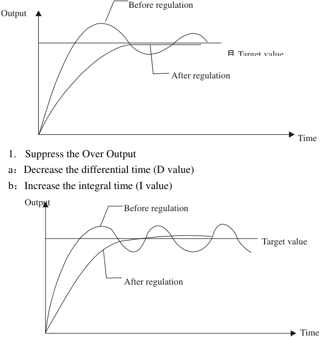

2. Suppress the oscillation

a：Decrease the differential time (D value) or set it to zero.

b：Decrease Proportional Constant (P value)

#### PD160 PID Target Value (*) **

*Set Range: 0—1 · Unit: — · Factory Setting: 0*

**\* This function is not available for the inverter of J series.**

The target value can be set through the selection of the panel or external analog. The external analog is 0~10V signal or given by the potentiometer.

When PD160=0, the target value of PID is the value set by PD159.

When PD160=1, the target value of PID is the value of the external analog 0-10V (corresponding to 0-100%), the setting of PD159 is invalid.

#### PD161 PID Upper Limit (*) **

*Set Range: 0—100% · Unit: — · Factory Setting: 100%*

**\* This function is not available for the inverter of J series.**

When PID feedback value is more than the set value of PD161 the corresponding multi-output will act and the inverter will not stop.

#### PD162 PID Lower Limit (*) **

*Set Range: 0—100% · Unit: — · Factory Setting: 0%*

**\* This function is not available for the inverter of J series.**

When PID feedback value is less than the set value of PD162 the corresponding multi-output will act and the inverter will not stop.

#### PD163 Communication Addresses

*Set Range: 00—250 · Unit: — · Factory Setting: 00*

When the inverter is set for RS-485 Communication interface control, each of the inverters will be set for its individual identification number through PD163.

- 00: No communication function.
- 01~250: Address for the inverters

#### PD164 Communication Baud Rate

*Set Range: 0—3 · Unit: — · Factory Setting: 1*

- 0: 4800 b/s
- 1: 9600 b/s
- 2: 19200 b/s
- 3: 34800 b/s

#### PD165 Communication Data Method

*Set Range: 0—5 · Unit: — · Factory Setting: 0*

- 0: 8N1 for ASCII
- 1: 8E1 for ASCII
- 2: 8O1 for ASCII
- 3: 8N1 for RTU
- 4: 8E1 for RTU
- 5: 8O1 for RTU

## IX-B. MODBUS Communication Protocol

When using the RS485 communication interface, each of the inverters must be set for its own address so that the computer can use this individual address to carry out the control.

### 1. Control modes

The communication protocol has two kinds of control mode:

1. RTU (Remote Terminal Unit) mode
2. ASCII (American Standard Code for Information Interchange) mode

Information of codes:

- RTU mode: each 8-bit data is composed of two 4-bit (hexadecimal) values, for example: 64H
- ASCII mode: each 8-bit data is composed of two ASCII bytes, for example: one byte 64H (hexadecimal) is composed of the ASCII bytes "6" (36H) and "4" (34H).

| Byte | 0 | 1 | 2 | 3 | 4 | 5 | 6 | 7 |
|---|---|---|---|---|---|---|---|---|
| ASCII code | 30H | 31H | 32H | 33H | 34H | 35H | 36H | 37H |

| Byte | 8 | 9 | A | B | C | D | E | F |
|---|---|---|---|---|---|---|---|---|
| ASCII code | 38H | 39H | 41H | 42H | 43H | 44H | 45H | 46H |

### 2. Communication Data Method

Character frame formats selected by PD165:

| PD165 | Mode | Frame | Start bit | Data bits | Parity | Stop bit | Frame length |
|---|---|---|---|---|---|---|---|
| 0 | ASCII | 8N1 | 1 | 8 | none | 1 | 10 bits |
| 1 | ASCII | 8E1 | 1 | 8 | even | 1 | 11 bits |
| 2 | ASCII | 8O1 | 1 | 8 | odd | 1 | 11 bits |
| 3 | RTU | 8N1 | 1 | 8 | none | 1 | 10 bits |
| 4 | RTU | 8E1 | 1 | 8 | even | 1 | 11 bits |
| 5 | RTU | 8O1 | 1 | 8 | odd | 1 | 11 bits |

In every case the data bits are sent in order 0…7 between the start bit and the parity/stop bit(s).

### 3. Communication Document Formats

#### 3.1 ASCII Mode

Communication document form:

| STX | ADDR | FUNC | LEN | DATA | CRC | END |
|---|---|---|---|---|---|---|
| ":" (3AH) | | | | DATA(n-1) … DATA0 | | CR (0DH) LF (0AH) |

1. STX: starting unit ":" (3AH).
2. ADDR: communication address, 8-bit data composed of two ASCII bytes.
   - 00: broadcast mode in MODBUS
   - 01~250: address of the corresponding inverter
3. FUNC: function code, 8-bit data composed of two ASCII bytes.
   - 01: FUNC READ, read the data of a function code
   - 02: FUNC WRITE, write the data of a function code
   - 03: write control data
   - 04: read control status data
   - 05: write inverter frequency data
   - 06: reserved
   - 07: reserved
   - 08: loop test

   a. Read function code data

   Format: `ADDR 01 LEN FUNC Data`

   ADDR=0 means no answer. ADDR≠0 means a reply from the inverter of this address. When the inverter replies normally, the format is `ADDR 01 LEN FUNC Data`. If DATA is one word, LEN=3; if DATA is one byte, LEN=2. When the inverter does not have this function code, or the reply has no effect, the format is `ADDR 81H 01 FUNC`.

   b. Write function code data

   Format: `ADDR 02 LEN FUNC Data`

   ADDR=0 is broadcast: it writes to all inverters, but there is no reply. ADDR≠0: set data and reply from the inverter of this address. When the setting is incorrect, or the inverter does not have this function, the format returned is `ADDR 81H 01 FUNC`.

   c. Control commands

   Format: `ADDR 03 LEN CNTR`

   ADDR=0 is broadcast: it writes to all inverters, but there is no reply. ADDR≠0: reply and return.

   CNTR:

   | 7 | 6 | 5 | 4 | 3 | 2 | 1 | 0 |
   |---|---|---|---|---|---|---|---|
   | jogr | jogf | jog | r/f | stop | rev | for | run |

   When the setting is correct it will return the present control status, format `ADDR 03 LEN CNST`.

   CNST:

   | 7 | 6 | 5 | 4 | 3 | 2 | 1 | 0 |
   |---|---|---|---|---|---|---|---|
   | Track start | Braking | r/f | jogging | running | r/f | jog | run |

   When the check is not correct: `ADDR 83H 01 CNST`.

   d. Read status value

   Format: `ADDR 04 01 CFG`

   ADDR=0: no reply. ADDR≠0: reply. CFG=0~7, reply is a single data item:

   | CFG | 0 | 1 | 2 | 3 | 4 | 5 | 6 | 7 |
   |---|---|---|---|---|---|---|---|---|
   | Item | Set F | Out F | Out A | RoTT | DCV | ACV | Cont | Tmp |

   For example, read the agreed (set) frequency:

   - Send: `01 04 03 00 CRC`
   - Return: `01 04 03 13 88 CRC`

   In which 13 88 are data: 13 for high order, 88 for low order (1388H = 5000 = 50.00 Hz).

4. LEN: data length. It means the length of D(n-1)…D0. Length set: when one word, LEN=3; when one byte or less than one byte, LEN=2.
5. DATA: data content (data characters). 2n ASCII characters compose n bytes; there are fifty ASCII characters at most.
6. LRC: longitudinal redundancy check. ASCII mode: the LRC is obtained by adding ADDR through the last data byte; if the result is more than 256, subtract 256 until the result is less than 256 (if the result is 128H, take 28H), then subtract the result from 100H to get the LRC.
7. Example: write 30.00 Hz to inverter 01 (write to PD003).

   | STX | ADDR | FUNC | LEN | DATA | LRC | END |
   |---|---|---|---|---|---|---|
   | ":" | "0" "1" | "0" "2" | "0" "3" | "0" "0" "0" "B" "B" "8" | "3" "7" | "CR" "LF" |
   | 3AH | 30H 31H | 30H 32H | 30H 33H | 30H 30H 30H 42H 42H 38H | 33H 37H | 0DH 0AH |

   Calculate LRC: 01H + 02H + 03H + 00H + 0BH + B8H = C9H. C9H subtracted from 100H: 37H.

   So the sent data is: `3AH 30H 31H 30H 32H 30H 33H 30H 30H 30H 42H 42H 38H 33H 37H 0DH 0AH`

#### 3.2 RTU Mode

| Quiet | ADDR | FUNC | LEN | D(n-1) ~ D(0) | CRC | Quiet |
|---|---|---|---|---|---|---|
| > 50 ms | | | | | | > 50 ms |

1. Quiet: the time of no data is more than 50 ms.
2. ADDR: communication address, 8-bit data.
3. FUNC: function code, 8-bit data, refer to 3.1 item 3.
4. LEN: data length, the length of D(n-1) ~ D0.
5. DATA: data content, n × 8-bit.
6. CRC: cyclical redundancy check (the source labels this LRC).

RTU mode: get CRC (Cyclical Redundancy Check). The CRC calculation method is as follows:

1. Make a 16-bit register and set its value to 0FFFFH (call it the CRC register).
2. Exclusive-OR the first byte of data with the low byte of the 16-bit CRC register and save the result to the CRC register.
3. Shift the CRC register 1 bit right, filling zero into the left bit, then check the low bit of the CRC register.
4. If the low bit is zero, repeat step 3; else exclusive-OR the CRC register with 0A001H.
5. Repeat steps 3 and 4 until the CRC register has been shifted right 8 times; then the byte is fully done.
6. Repeat steps 2 to 5 for the next byte of data, until all data has been processed. The final value of the CRC register is the CRC value. When sending the CRC value in command data, the low and high bytes must swap sequence, i.e. the low byte is sent first.
7. Example 1: write 30.00 Hz to inverter 01.

   Command data:

   | ADDR | FUNC | LEN | DATA | CRC |
   |---|---|---|---|---|
   | 01H | 02H | 03H | 00H 0BH B8H | 7FH 0CH |

   Sent data: `01H 02H 03H 00H 0BH B8H 7FH 0CH`

8. Example 2: the following gets the CRC value in C. The function has two parameters: `data`, a pointer to the data buffer, and `length`, the number of bytes in the buffer. It returns the CRC value as an unsigned integer. (The listing in the source PDF contains typesetting errors such as `*data=++` and `j++={`; the intended code is reproduced here.)

   ```c
   unsigned int crc_chk(unsigned char *data, unsigned char length)
   {
       int j;
       unsigned int reg_crc = 0xffff;
       while (length--) {
           reg_crc ^= *data++;
           for (j = 0; j < 8; j++) {
               if (reg_crc & 0x01) {           /* LSB(b0) = 1 */
                   reg_crc = (reg_crc >> 1) ^ 0xa001;
               } else {
                   reg_crc = reg_crc >> 1;
               }
           }
       }
       return reg_crc;
   }
   ```

#### PD170 Display Items

*Set Range: 0—5 · Unit: 1 · Factory Setting: 0*

This parameter is only valid when Bit 2 is set to 1 in PD171. For the details refer to PD171.

- 0: Inverter Temperature
- 1: Counter Value
- 2: PID Target Value
- 3: PID Feedback Value
- 4: Present running time of power up (Unit: Hour)
- 5: Total running time of power up (Unit: Hour)

#### PD171 Display Items Open

*Set Range: 0—7 · Unit: 1 · Factory Setting: 0*

This parameter is set for selection of displaying of DC voltage, AC voltage and other items so that the customer can monitor and view them in sequence through the switch key.

It is set first in the binary 3-bit mode, and then converted to a decimal value (0: invalid, 1: valid for each bit):

| Bit | Selects |
|---|---|
| Bit0 | DC Voltage |
| Bit1 | AC Voltage |
| Bit2 | The display items selected by PD170 |

In the contents displayed the factory setting is to show output frequency, set frequency, output current and output revolution through the switch key. If it is necessary to view and monitor other items they can be set through PD170 and PD171.

#### PD172 Fault Clear **

*Set Range: 00—10 · Unit: 1 · Factory Setting: 00*

01 is for fault clear. Others have no function.

#### PD174 Rated Current of Inverter

*Unit: 1A · Factory Setting: \**

It is depending on the model and can't be changed.

#### PD175 Inverter Model

*Set Range: 0—1 · Unit: 1 · Factory Setting: 0*

- 0: Constant torque
- 1: For kinds of fan

It can be observed, but not changed.

#### PD176 Inverter Frequency Standard

*Unit: 1 · Factory Setting: \**

- 0: 50Hz
- 1: 60Hz

It is factory setting. It can be observed, but not set.

#### PD177–PD180 Fault Records 1–4

*Factory Setting: ———*

| Code | Function |
|---|---|
| PD177 | Fault Record 1 |
| PD178 | Fault Record 2 |
| PD179 | Fault Record 3 |
| PD180 | Fault Record 4 |

When it has no fault record it shows ———. After access to this parameter the fault display can be checked.

#### PD181 Software Version

*Factory Setting: \**

It can be observed, but not set.

#### PD182 Manufacture date

*Factory Setting: \**

It is factory setting. It can be observed, but not set. The five displayed digits are read as follows:

| Digits | 5 4 | 3 2 | 1 |
|---|---|---|---|
| Meaning | Year (年) | Month (月) | Week (周) |

#### PD183 Serial No.

*Factory Setting: \**

It is factory setting. It can be observed, but not set.

**Note:**

- \* means the said parameter has a variety of set values or should be set specifically according to concrete conditions.
- \*\* means the said parameter can be set during the operation.

## X. Simple Electrical Connection with Water Cooling Spindle

### 1. Basic Wiring

Cable requirement: 0.75 mm² per copper wire. Mains plug → socket with a switch → inverter input terminals E, R, S, T. Inverter output terminals U, V, W → shielded cable (reduces noise effects) → 4-pin head, plugged into the VFD motor.

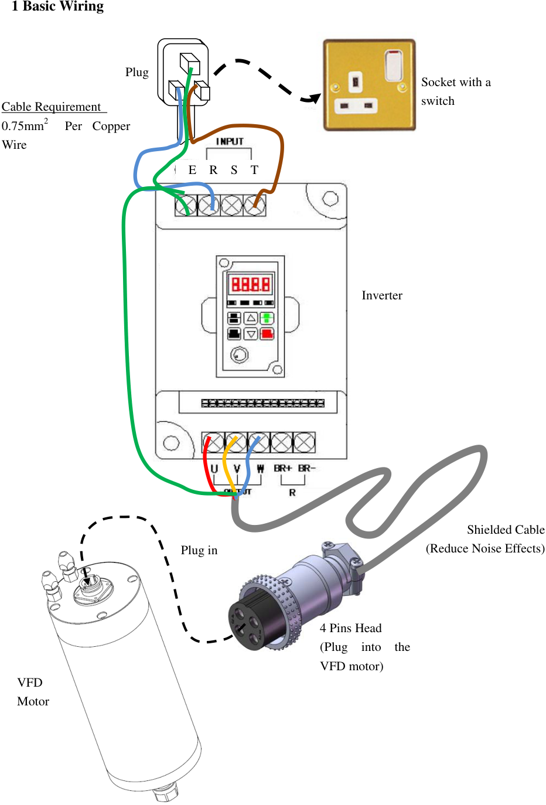

### 2. Cable Head Description

| Pin Number | Motor Poles |
|---|---|
| 1 | U (Red) |
| 2 | V (Yellow) |
| 3 | W (Blue) |
| 4 | GND (Green) |

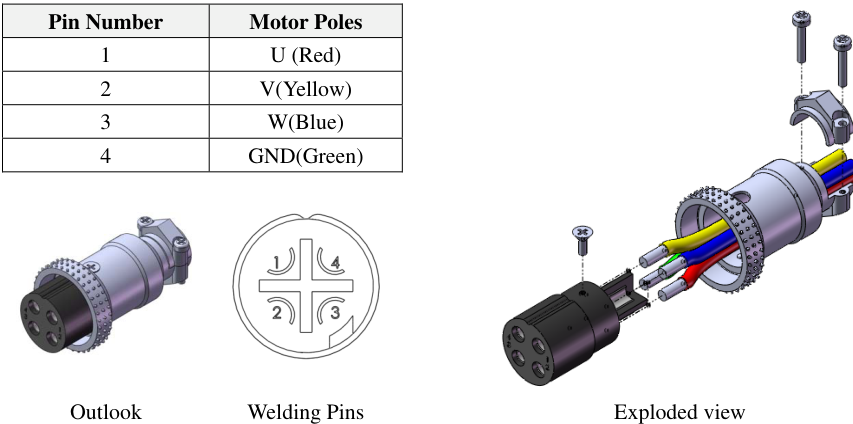

### 3. VFD Motor Socket Descriptions

#### A. Connecting Pins

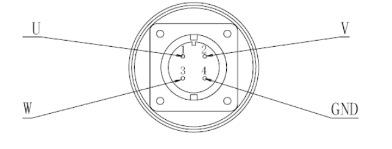

#### B. Specification

| Items | Descriptions |
|---|---|
| 1. Spindle type | GDZ65-800A |
| 2. Rev (rpm) | 24000 |
| 3. Power (kW) | 0.8 |
| 4. Voltage (V) | AC110V / AC220V |
| 5. Current (A) | 6 / 5 |
| 6. Frequency (Hz) | 400 |
| 7. Cooling | cooled by water |
| 8. Bearing type | 2×7002C P4 DT & 2×7000C P4 DT |
| 9. Lubricate | Grease |
| 10. Collet type | ER11 |
| 11. Repair time | Bearing (half year), Spindle (one year) |
| 12. Weight (kg) | 3 |
| 13. Diameter (mm) | 65 |

## XI. Cooling System Installation of Water Cooling Spindle

User can buy a plastic water container as a water tank, which must be a sealed tank for preventing the dust or other small particles to flow inside the motor. Please consider insulation between the power cable and water.

### 1. Submersible Water Pump

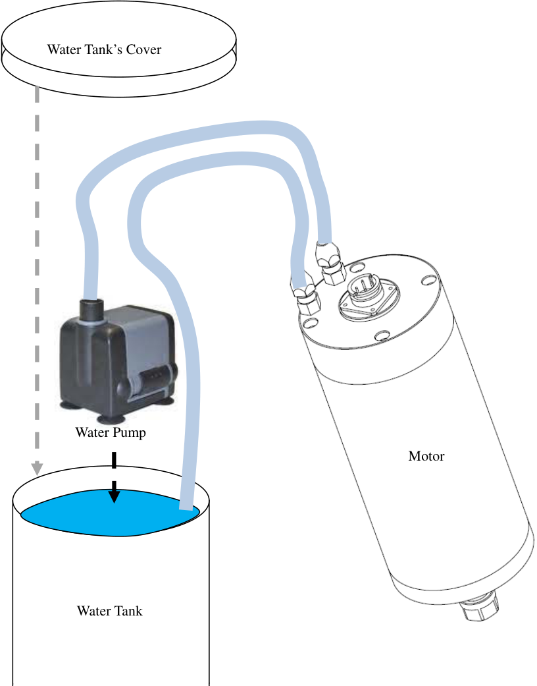

### 2. General Water Pump

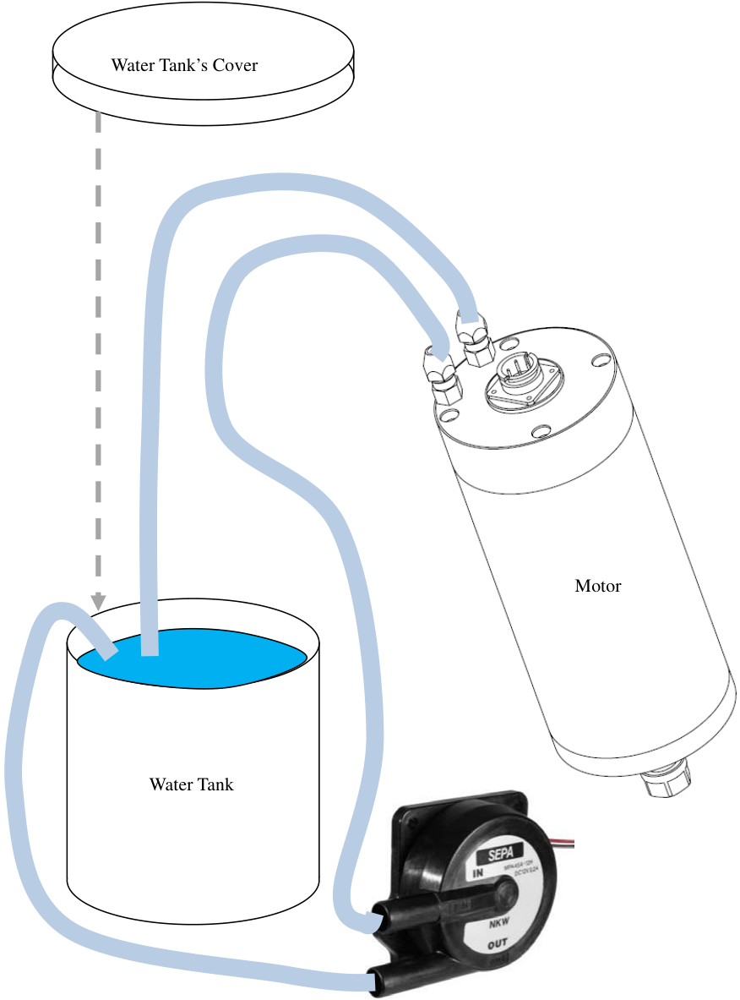

## XII. User Preferences Table

| Preferences' Number | Functions Names | User Setting Value |
|---|---|---|
| | | |
| | | |
| | | |
| | | |
| | | |
| | | |
| | | |
| | | |
| | | |
| | | |

Note: Technical person complete this form carefully, this is helpful for your customer's self-adjustment in the future.

Name: ______________________

Telephone: ______________________

## Contact Us

**CNCDIY Routing Machine System – Hong Kong**

- Website: www.cncdiy.org
- Email: cncdiy_selling@ymail.com
- MSN: cncdiy@ymail.com
- Skype: cncdiy@ymail.com
- Forum (English): http://cncdiy.forumr.biz/index.htm

**CNC-Shop – Switzerland**

- Website: http://www.cnc-shop.ch/
- Email: info@cnc-shop.ch
- Fax: +41 (0)21 534 64 31

**Forum**

(English): http://cncdiy.forumr.biz/index.htm

We hope that you can share your experiences with using our machines! Otherwise, if you have any problem with using our product, please feel free to leave a message on this forum.

© 2010 CNCDIY CNC Routing Machine System. All Rights Reserved.
